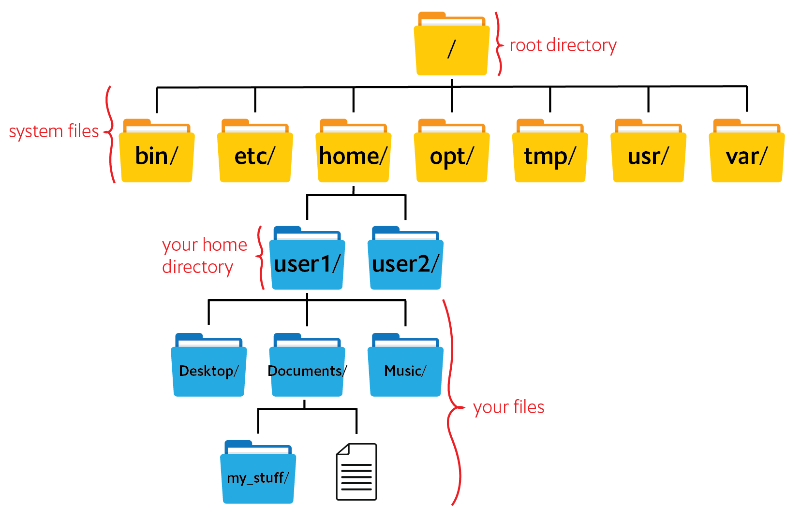
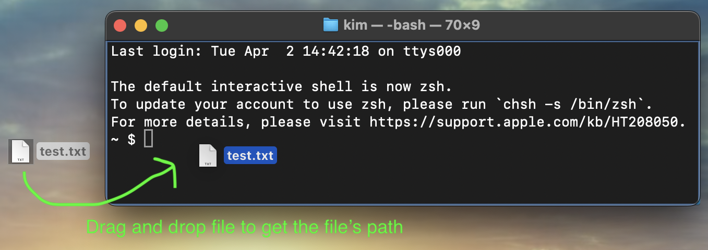
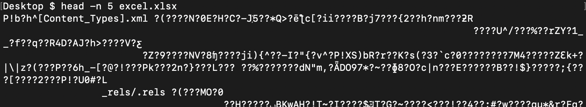
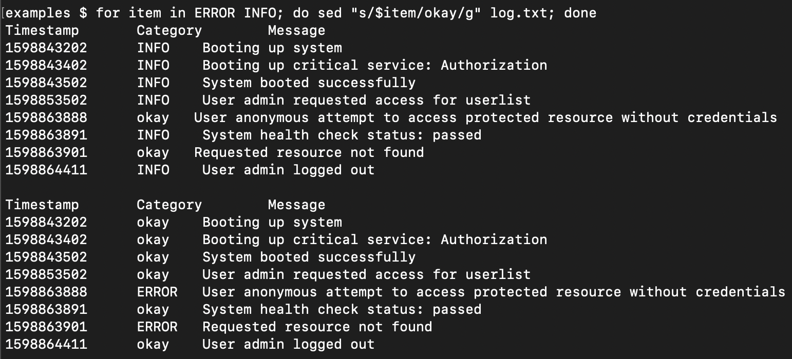

# Introduction to command line
Bioinformatics relies on free, open-source programs created by the scientific community. The vast majority of programs are solely text-based, so no buttons to click, drop-down menus for options, or search bars for help.

## Getting started
Linux: Open the program “Terminal” <br>
macOS: Open the program “Terminal” and run `chsh -s /bin/bash` <br>
Windows: Install and open "Ubuntu" following the "Install WSL command" section [here](https://learn.microsoft.com/en-us/windows/wsl/install#install-wsl-command).

In addition to `command line`, you may have heard the terms `terminal`, `console`, `shell`, or `CLI`. Technically they are different things, but people often use these words interchangeably.

Command line uses the keyboard to interact with the computer. You enter text commands to navigate, run programs, and configure your computer system. It's the exact same content as the point-and-click graphical user interface (GUI) you're more familiar with.

To run a command, type the command at the prompt and then press enter. Try this with `pwd`
<p align="left">
  
</p>

___

## Directory navigation


Computer files are organized in a series of nested, hierarchical directories (folders) starting with the root directory. Each user has their own home directory where their files are stored. To distinguish files from directories, directory names end in `/` while file names do not.

NB: "Folder" and "directory" are synonymous and used interchangeably.

### Paths
Each directory and file has a "path". Think of it as an address within the hierarchical structure. Paths start at root and go down each level until it reaches the directory or file. For example, the path to user1's desktop directory is `/home/user1/Desktop/`

For directories, the last backslash `/` can be omitted, so the path to user1's desktop directory can also be written as `/home/user1/Desktop`

The path to your home directory can be abbreviated as `~`, so the path to user1's desktop directory can also be written as `~/Desktop`

Instead of typing the full name, **paths and files can be auto-filled using the tab key** (tab-completion). For example, typing `~/De` `tab` will automatically complete with `~/Desktop`

**_Question:_** Based on the above figure, why would `~/D` `tab` fail to tab-complete?

<details>
<summary>Answer</summary> 

There are two directories that start with "D" (Desktop and Documents). Tab-complete doesn't know which one you want, so it can't complete the path for you. Once you have a unique word, in this case `~/De`, the only directory it could be is the Desktop directory, so tab-complete works. 

</details>

<br>
NB: One way to get a file or folder path is to drop the item into the Terminal.



NB: Command line has a hard time understanding whitespace in file or directory names. For example, is `my file.txt` one file or two files named "my" and "file.txt"? **Best practice is to never have whitespace in names.** "my file.text" should be "my_file.text", "my-file.txt", "myFile.txt", etc. Also, do not include any symbols in file names except for `-` or `_` or `.`

___

## Basic commands

`pwd` = "print working directory". It answers the question "Where am I?" by showing the path to the current directory. `tree` displays a visualization of pwd.

`ls` = "list". It shows the contents of the current directory. To see information like file size or last access date use `ls -lh`

`cd` = "change directory", with the usage `cd /path/to/directory`. To move up (go back) one level use `cd ..`

`mkdir` =  "make directory", with the usage `mkdir new_folder_name`. It makes a new directory within the current directory.

`cp` = "copy", with the usage `cp file_name copy_file_name`

`mv` = "move", with the usage `mv file_name /path/to/new/directory`. If a file with the same name already exists, `mv` will overwrite the original file without warning. To rename a file, use `mv file_name new_file_name`

`rm` = "remove", with the usage `rm file_name`. Note that command line does not have an "undo" function so **_deletions are permanent_**.

`cat` = "concatenate". It combines multiple files `cat file1 file2 > file1and2` and can print the contents of a file to the screen `cat file_name`

For directories, add `-r` to `cp`, `mv`, and `rm`. For example, use `rm -r folder_name` to delete a folder.

**_Task:_** Go to your desktop directory. Make a folder named `examples`

NB: If the command line gets stuck or you want to cancel a running command use `control + c`

NB: Command line saves a history of executed commands. Use the up arrow to go through your most recent commands; this is useful when you need to rerun the same command.

___

## Text files
Command line cannot read files written in graphical programs like Word and Excel. 

What happens when we try to look at an Excel file?


Instead, files are in plain text. Multiple text editors are built into the command line. We will use `nano`.

**_Task:_** Use the command line to make and edit new text file.
1. Go into your examples directory by running `cd ~/Desktop/examples`
2. Open the text editor by running `nano` or `nano hello.txt`
3. Type `Hello World!`
4. Exit nano `control+x`. It will ask you to "Save modified buffer". Type "Y" and use the file name `hello.txt`

**_Question:_** Without clicking on anything, how can we use the command line to check if you made a new file in your examples folder?

<details>
<summary>Answer</summary> 

Use the `ls` command.

</details>

<br>
We can also make a new, empty file without opening a text editor by using `touch new_file_name`

Did you catch the three ways to make a new file?

* `nano`
* `nano new_file_name`
* `touch new_file_name`

NB: File extensions are important for understanding file contents. For example, a file named "sample1" could be anything, e.g., a text file with metadata or a fastq file with sequence reads. Naming the file sample1.txt or sample1.fq avoids this problem.
___

## Redirect output
By default, the normal output of a command/execution prints to the screen. This is known as standard out (stdout). If you want to save stdout to a file, redirect it by adding `> new_file_name` to the end of the command.

**_Task:_** Redirect a command output.
1. In your "examples" folder run `ls`
2. Then run `ls > output.txt`. Nothing will print to the screen but a new file should appear named `output.txt`
3. Does the output of `ls` match the contents of `output.txt`?

___

## Editing and viewing files
We will create a data file and use command line tools to extract information or manipulate the file **without opening the file**. These tools have many options; we'll look at the basics. 

**_Task:_** Create a data file.
1. Go to your "examples" directory
2. Make a new text file `nano log.txt`
3. Copy and paste the text below.
4. Save the file and exit nano `control+x`

```
Timestamp       Category        Message
1598843202      INFO    Booting up system
1598843402      INFO    Booting up critical service: Authorization
1598843502      INFO    System booted successfully
1598853502      INFO    User admin requested access for userlist
1598863888      ERROR   User anonymous attempt to access protected resource without credentials
1598863891      INFO    System health check status: passed
1598863901      ERROR   Requested resource not found
1598864411      INFO    User admin logged out
```

### Viewing files
`cat` prints the entire file to screen. If you accidentally cat a large file, use `control + c` to kill the command.

`head -n <number> file_name` displays the first `<number>` lines of the file.

`tail -n <number> file_name` displays the last `<number>` lines of the file.

To get a specific range of lines, for example, lines 20-25, use `sed -n '20,25p' file_name` 

### How many lines?
`wc` (word count) is useful for counting characters/words/lines. You can use it as follows:
```
wc -c log.txt
wc -l log.txt
wc -w log.txt
```
**_Question:_** Can you figure out what each of these options do? 

<details>
<summary>Answer</summary> 

```
wc -c log.txt    # Counts how many characters are in the file
wc -l log.txt    # Counts how many lines are in the file
wc -w log.txt    # Counts how many words are in the file
```

</details>


### Find text with `grep`
`grep` searches every line in the file for word(s) that you provide (the pattern). If a line has a matching pattern, grep will print that line; grep only searches for text and cannot make edits.

The grep format is `grep [OPTIONS] "search_word" file_to_search` <br>
The search_word must be in quotes and is case-sensitive.

**_Task:_** We want to know how many ERROR events are in log.txt. We can:
1. Print every line with the word "ERROR" `grep "ERROR" log.txt`
2. Count the number of lines with the word "ERROR" `grep -c "ERROR" log.txt` 

### Find and replace text with `sed`
`sed` can edit text within a file. One common use of sed is find and replace.

To replace all occurrences of a word, the sed find and replace format is <br>
`sed 's/search_word/replace_word/g' file` <br>

Unlike grep, search_word is not in quotes but it is still case-sensitive, however, 's/search_word/replace_word/g' must be in quotes.

**_Task:_** Replace all occurrences of the word "ERROR" with the word "check".

### `awk`: it's complicated
`awk` is an entire programming language that can do the same tasks as grep and sed but also a lot more. 

One common reason to use `awk` is to access data in columns. Columns are numbered from $1 to $n.

**_Task:_** Print column 2 of log.txt by running `awk '{print $2}' log.txt`

___

## For loops
For loops are useful when you need to run the same command(s) on multiple files.

In Bash, the for loop format is:

```for item in [LIST]; do [COMMANDS] $item; done```

### For loop from a list
**_Task:_** In log.txt, replace the all occurrences of the words "INFO" and "ERROR" with the word "okay" by running `for item in ERROR INFO; do sed "s/$item/okay/g" log.txt; done`

A few things to note:
* The words in the list "ERROR INFO" are separated by spaces, not commas.
* "item" is a variable that changes meaning from "ERROR" to "INFO". Because of this `s/$item/okay/g` is in double quotes instead of single quotes.
* The variable can be any word; it is very common for people to use `f` or `i`

The output should look like this:


**_Question:_** Why is the data displayed twice? Hint: what's the difference between the first and second iteration? In the second iteration, why is only "INFO" replaced with "okay" when our list has both "ERROR" and "INFO" to be replaced?

<details>
<summary>Answer</summary>

Each iteration of the data represents the for loop working on each item in the list (our list had two items). We did not tell the loop to save changes to log.txt, so the second loop iteration doesn't know that in the first iteration "ERROR" was replaced with "okay".

</details>

<br>

Rerun the for loop, but this time redirect the output:
1.  `for item in ERROR INFO; do sed "s/$item/okay/g" log.txt > log_edited1.txt; done` <br>
2. Look at the output file's contents `cat log_edited1.txt`

**_Question:_** Why is the data NOT displayed twice when the output is redirected to log_edited1.txt?

<details>
<summary>Answer</summary>

When we redirect the output to log_edited1.txt, the for loop now saves the output of each iteration to log_edited1.txt. This means the file is _overwritten_ for each item in the list. What the file contains at the end of the for loop is the results of the last iteration.

</details>

### For loop from a list in a file
[LIST] can also be a file where each line is a different item. The for loop reads each line one at a time and runs the same commands on every item in the list.

**_Task:_** In log.txt, replace the words "INFO" and "ERROR" with the word "okay", but this time "INFO" and "ERROR" will be read from a file.

1. In nano, make a new text file named "search.txt" and list "INFO" and "ERROR" in a column like this:
```
ERROR
INFO
```
2. Save and close nano. Then run: <br>
``for item in `cat search.txt`; do sed "s/$item/okay/g" log.txt > log_edited2.txt; done``
3. Compare the contents of log_edited1.txt and log_edited2.txt.

A few things to note:
* The backtick character `` ` `` lets us call a function within another command. 
* The backtick `` ` `` is not the same as the single quote `'`. On a keyboard, the backtick is usually to the left of the "1" key while the single quote is over on the right side of the keyboard next to the "enter" key; make sure not to mix those up! 
* For the genotyping pipeline we will do many of this type of for loop.

**_Question:_** The command `echo` prints whatever follows to the screen. A pipe `|` takes the output of the function on the left and passes it to the function on the right. What does this for loop do?

``for f in `cat search.txt`; do echo $f | wc -c; done``

<details>
<summary>Answer</summary>
It gets the number of characters for each item in the search.txt list.
<br><br>
Each item in search.txt is printed to the screen, but because we're using a pipe, the output is passed to the  `wc -c`  command which counts the number of characters.

</details>
