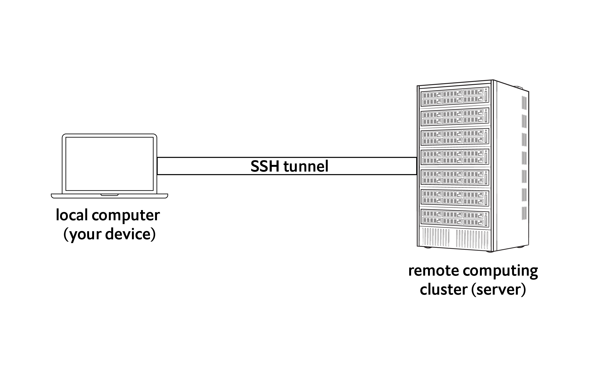
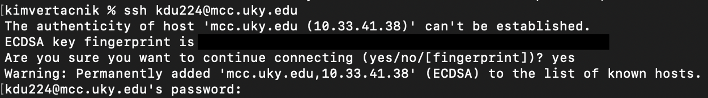
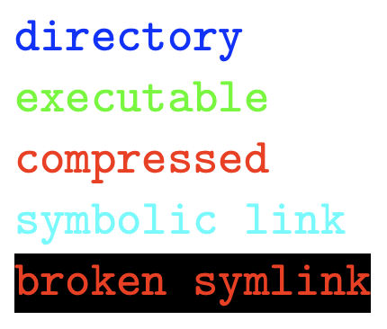
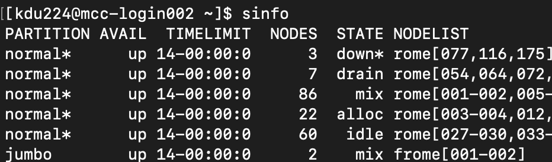
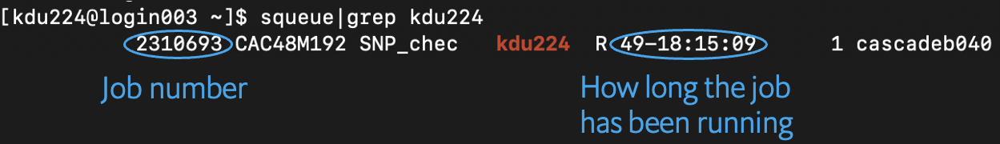

# Remote cluster (MCC)



## Connect
`ssh` (secure shell) establishes a connection from your computer to the cluster. You must have an account on the cluster in order to log in.

On your computer run `ssh user_name@mcc-dtn.ccs.uky.edu` 

The first time you connect to the cluster, you will get a message like this; type `yes` to continue.


After successfully logging in, the command line prompt will change to show that. It should look something like this `[user_name@mcc-login001 ~]$`

To disconnect from MCC, run `exit`

NB: Once you connect, you will be working with two computers: your local computer and the remote cluster. When running commands, pay attention to where your working directory is located (i.e., which computer you are working on.)

___

## Make your working directory on MCC
1. After logging on to MCC, go to our course directory <br>
 `cd /pscratch/jdu282_brazil_bootcamp2023/`

2. View the contents of the class directory with `ls`

3. Go into the "students" folder and make a new directory <br>
 `cd students` <br>
 `mkdir your_name`

4. Run `ls` again. You should see a folder with your name. How do we know it’s a folder? The name is color-coded in blue.

What do all the colors mean? Here are some of the more common ones.
<p align="left">
  
</p>

___

## Transferring files 

### Copy files from your local computer to the cluster
Your current working directory and local_file must be on your local computer.

If local_file is in your current working directory: <br>
`scp local_file user_name@server_address:/path/to/cluster/directory`

If local_file is in another directory: <br>
`scp /path/to/local_file user_name@server_address:/path/to/cluster/directory`

### Copy files from the cluster to your local computer
Again, the current working directory must be on your local computer.

`scp user_name@server_address:/path/to/cluster/remote_file /path/to/local/directory`<br>

If the destination is the local current working directory, `/path/to/local/directory` can be replaced with `.` <br>
`scp user_name@server_address:/path/to/cluster/file.txt .`

**_Question:_** How do you modify the `scp` command to transfer a directory?

<details>
<summary>Answer</summary> 

`scp -r`

</details>

<br>

**_Task:_** Earlier you made a file named `hello.txt` (in your "examples" folder).
Copy that file from your computer to your folder on the cluster. Then delete the file from the cluster.

### Another way to transfer files
Like ssh, the command `sftp` moves files but is more interactive in that you enter a special shell within the current shell. 

Let's say you're on your local machine in a directory with a file you want to transfer. Run `sftp user_name@server_address` and enter your password. Once you hit enter, you will be in your home directory _on the cluster_ and the prompt changes to `sftp>`. Now you can move around your directory structure on the cluster (i.e., use `cd`, `ls`, etc.) and navigate to you want to put the file. 

Then run `put local_file` to transfer the file from your local machine to the cluster. Likewise, to get a file off the cluster run `get remote_file` and it will transfer the file from the cluster to your local machine. Run `exit` to quit sftp.

**_Task:_** Using sftp, copy the `log.txt` file you made previously from your computer to your folder on the cluster. Then delete the file from the cluster. Make sure you're in the folder that has log.txt when you start sftp.

___

## Slurm job submission
MCC uses Slurm (Simple Linux Utility for Resource Management) to manage user demand and system resources. It is a job scheduling system where users submit their commands ("jobs") as job scripts (also known as batch scripts). When you submit a job, what you're doing is requesting the use of computer processors (nodes). 

Job script files must end in `.sh` and must start with the following lines:

```
#!/bin/bash
#SBATCH --partition=        # Processor type
#SBATCH --time=             # How long you want to use the resources
#SBATCH --nodes=            # How many processors; typically 1
#SBATCH --ntasks=           # How many cores on the processor
#SBATCH --account=          # CPU hours are monitored and charged

Optional
#SBATCH --mail-type=ALL     # Notify when job starts/ends/fails
#SBATCH --mail-user=        # Your email address
```

NB: A hash character followed by a space `# ` means "do not execute anything on this line after this symbol". It's a way to leave comments that won't interfere with the code.

To see what types of processors are available run `sinfo`
<p align="left">
  
</p>

The format for --time= is day-hour:minute:second, e.g., 00-01:00:00 means 1 hour.

NB: Notification emails often end up in spam/junk folders.

**_Task:_** In your folder on MCC, make a new file named "job_header.sh" and add the following lines. We will use this file as a template for job submission.
```
#!/bin/bash
#SBATCH --partition=normal
#SBATCH --time 01-00:00:00
#SBATCH --nodes=1
#SBATCH --ntasks=32
#SBATCH --account=coa_jdu282_brazil_bootcamp2023
#SBATCH --mail-type ALL
#SBATCH --mail-user <your email address>
```

To submit a job run `sbatch your_job_script.sh`

Once you submit a job, you can check its status with `squeue | grep "mcc_user_name"`. If all processors are in use, your job will wait until resources are available; `TIME 0:00` means your job has not started.



Each job gets a job number and a corresponding `slurm-job_number.out` file. This file has the information that is normally printed to the screen as the program is running (stdout). 

To cancel a submitted job use `scancel job_number` (get the job number from `squeue | grep mcc_user_name`)

See [here](https://ukyrcd.atlassian.net/wiki/spaces/UKYHPCDocs/pages/72418017/Submitting+jobs+on+MCC+for+first-time+users) for additional information. <br>
If the link fails, go to the left sidebar --> UKY RCD Documentation --> Morgan Compute Cluster (MCC) --> Submitting jobs on MCC (for first-time users)


NB: All data analysis should be submitted as a job. **Do not run jobs on the login node.**

___

## Submit your first cluster job!
Now let's create a job file and submit a command that we can watch as it progresses. Create a new file named counting.sh, and paste the following into it:

```
#!/bin/bash
#SBATCH --partition=normal
#SBATCH --time 01:00:00
#SBATCH --nodes=1
#SBATCH --ntasks=1
#SBATCH --account=coa_jdu282_brazil_bootcamp2023
#SBATCH --mail-type ALL
#SBATCH --mail-user <your email address>

echo "starting"
sleep 10
echo "it's been 10 seconds"
sleep 20
echo "it's been 30 seconds"
sleep 30 
echo "it's been 60 seconds. Exciting!"
sleep 5
echo "it's been 65 seconds. Amazing."
sleep 6
echo "it's been 71 seconds. What are we deviating from 5 second intervals???"
```

Save the file, and then use `cat` to check that the job submission file looks correct.

Submit the job using the following command: `sbatch counting.sh`

Once the job is submitted, check that it's running by using `squeue`. Lots of stuff, right? That output is a list of all the jobs that are currently running on the cluster. We can subset that in two ways. First, we could just grep our username:
```
squeue | grep "mcc_user_name"
```

Or you can use an option in squeue:
```
squeue -u "mcc_user_name"
```

Let's check on the status of the job. Standard out (stdout) for computers is the normal output of a command. Standard error (stderr) is any error messages that arise from a command. The default location for stdout when MCC is running a job is in a file called `slurm-jobID.out`. 

So let's see what's in the slurm file. It should be in the same directory as the batch script. Try using `cat` to see what's in that file. If the job is still running, can you figure out where you are in the job commands?

Another way to interact with the stdout from a job is to write that output to another file. Take the `counting.sh` file and at the end of each "echo" line, add the following `>> counting_output.txt`. Resubmit the job, and now see if you can follow the status of the job in real time using `cat` and the `counting_output.txt` file.

You should have emails in your inbox that document when these jobs started and ended. The exit code is important in this email, as it lets you know if the job finished with no issues (exit code 0) or with an error or other issue. See [here](https://hpc-discourse.usc.edu/t/exit-codes-and-their-meanings/414) for more info on exit codes. They can be very useful when troubleshooting errors!

___

## Modules
Some programs are already installed on MCC, however, they need to be activated in order to work.

`module list` lists the activated programs on your account.

`module avail` lists the programs installed on the cluster. Use `module avail | grep "program_name"` to search for a specific program (note that most module names are in lowercase).

`module load module_name` activates the program for your current session

`module unload module name` deactivates/removes the program from your account

___

## Singularities
The full list of singularity programs is [here](https://ukyrcd.atlassian.net/wiki/spaces/UKYHPCDocs/pages/72417975/Software+list+for+singularity+containers+for+conda+packages+in+the+MCC+cluster). <br>
If the link fails, go to the left sidebar --> UKY RCD Documentation --> Morgan Compute Cluster (MCC) --> Software list for singularity containers

These are like modules except that instead of loading them, the singularity information is added to the job script.

```
container=/from/container_name_and_location/column
singularity run --app app_name_from_the_second_column $container program_command
```
___

## Getting data for read mapping and SNP calling with GATK
SNP calling from whole-genome (shotgun) sequence data requires a reference genome plus sequencing reads from multiple individuals. The reads are mapped to the reference and genotypes are called from the alignments.

We're going to use Bactrocera dorsalis (oriental fruit fly) whole-genome sequence data from [this paper](https://onlinelibrary.wiley.com/doi/full/10.1111/eva.13507).

### **_Task:_** Get sequencing read files
Our data is from this [BioProject](https://www.ncbi.nlm.nih.gov/bioproject/PRJNA893460/). We need to download shotgun reads for multiple individuals, which is a repetitive task (and the perfect opportunity to use a for loop!).

A list of the SRA accessions is at `/pscratch/jdu282_brazil_bootcamp2023/data/Bdor_WGS_SRA_list.txt`

You were all assigned a set of four samples, to get a file with the accession values run <br>
`sed -n '<lower_number>,<upper_number>' /pscratch/jdu282_brazil_bootcamp2023/data/Bdor_WGS_SRA_list.txt > SRA_accessions.txt`

To download from NCBI, we need to use the program [SRAtoolkit](https://github.com/ncbi/sra-tools/wiki/01.-Downloading-SRA-Toolkit). It's already installed at `/pscratch/jdu282_brazil_bootcamp2023/programs/sratoolkit.3.1.0-ubuntu64/`

Make a copy of your job script template `cp batch_header.sh SRA_download.sh`

Open SRA_download.sh and add the following after the header:
```
for f in `cat SRA_accessions.txt`; do /pscratch/jdu282_brazil_bootcamp2023/programs/sratoolkit.3.1.0-ubuntu64/bin/prefetch $f; /pscratch/jdu282_brazil_bootcamp2023/sratoolkit.3.1.0-ubuntu64/bin/fasterq-dump --outdir fastq --skip-technical --threads 32 $f/$f.sra; rm -rf $f; done
```

Then submit your job `sbatch SRA_download.sh`. Assuming it starts right away, this should take about 10 minutes and you should have a new folder named "fastq".

___

### **_Task:_** Subsample sequencing read files
The sequence files have ~20-30 million reads. To speed up analysis time, let's subsample them down to 1 million reads. This way, we'll have enough time for the entire genotyping pipeline, but it will obviously affect the final SNP dataset that we obtain at the end.

Make and submit a batch script named SRA_subsample.sh with these commands. Also change `#SBATCH --ntasks=32` to `#SBATCH --ntasks=1`. This job will take about 10 seconds.

```
cd fastq

for f in `cat /path/to/SRA_accessions.txt`; do head -n 4000000 "$f"_1.fastq > "$f"_1Mreads_R1.fastq; head -n 4000000 "$f"_2.fastq > "$f"_1Mreads_R2.fastq; done
```

**_Question:_** Can you follow what's going on in this job? Why are we getting 4000000 lines per file? And what does the `>` do?

<details>
<summary>Answer</summary> 

For each SRA accession, get the first 4 million lines from the read 1 file and redirect the output to SRAaccession_1Mreads_R1.fastq, then do the same for the read 2 file.

In a fastq file, each sequencing read is four lines long, so to subset 1 million reads, we need 4 million lines from the original read file.

The `>` is redirecting the output from the `head` command to the subsample read file.

</details>