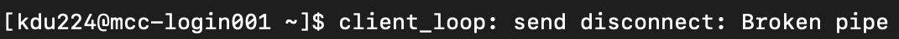
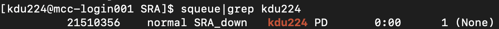
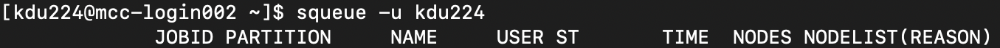

# Remote cluster (U. Kentucky MCC)


## Connect to the cluster
`ssh` (secure shell) establishes a connection from your computer to the cluster. You must have an account on the cluster before logging in.

1. Launch the GlobalProtet VPN and log in with your U. Kentucky linkblue ID.
    <p align="left">
      
    </p>

2. On your computer, open Terminal and run `ssh user_name@mcc.uky.edu` <br>
If you have a cluster account but no VPN access, connect via the DTN node `ssh user_name@mcc-dtn.ccs.uky.edu`
    * user_name is typically your linkblue ID, e.g., kdu224.

3. The first time you connect to the cluster, you will get a message like this. Type `yes` to continue.

    <p align="left">
      
    </p>

4. It will then ask for your password. Type it in but note that nothing will appear on the screen.

<br>

After successfully logging in, the command line prompt will change. It should look something like this `[user_name@mcc-login001 ~]$`

To disconnect from the cluster, run `exit`. Don't forget to exit the VPN.

If you see something like this, it means you lost connection to the cluster and will have to ssh back in.
    <p align="left">
      
    </p>


Windows users: if the VPN is preventing Terminal from connecting to the cluster see [here](https://learn.microsoft.com/en-us/windows/wsl/troubleshooting) or use the DTN node mentioned in step 2 (it's easier to just use the DTN node). 

NB: Once you connect, you will be working with two computers: your local computer and the remote cluster. When running commands, **pay attention to where your working directory is located** (i.e., which computer you are working on.)

___

## Make your working directory on MCC
1. After logging on to MCC, go to our course directory <br>
 `cd /pscratch/kdu224_iceland_bootcamps2024/` <br>
Try using tab-complete so that you don't have to type out this long path.

2. View the contents of the class directory with `ls`

3. Go into the "students" folder and make a new directory (this will be your working directory on the cluster). <br>
 `cd students` <br>
 `mkdir <your_name>`

4. Run `ls` again. You should see a folder with your name. How do we know it’s a folder? The name is color-coded in blue.

<br>

What do all the colors mean? Here are some common ones.
<p align="left">
  
</p>

___

## Transferring files 

### Copy files from your local computer to the cluster
Your current working directory and <local_file> must be on your local computer.

If <local_file> is in your current working directory: 
```
scp <local_file> user_name@server_address:/path/to/cluster/directory/
```

If <local_file> is in another directory:
```
scp /path/to/local_file user_name@server_address:/path/to/cluster/directory/
```

### Copy files from the cluster to your local computer
Again, the current working directory must be on your local computer.

```
scp user_name@server_address:/path/to/cluster/remote_file /path/to/local/directory/
```

If the destination is the local current working directory, `/path/to/local/directory/` can be replaced with `.` 
```
scp user_name@server_address:/path/to/cluster/remote_file .
```

**_Question:_** How do you modify the `scp` command to transfer a folder?

<details>
<summary>Answer</summary> 

Add `-r`, so the command would be `scp -r`

</details>

<br>

**_Task:_** Earlier you made a file named `hello.txt` (in your local "examples" folder). Use `scp` to copy hello.txt from your local computer to your folder on the cluster.
1. On the **cluster**, go into your folder on the cluster. Get the folder's path with `pwd`
2. On your **local computer**, go into your "examples" folder.
3. In your examples folder run the following. Don't forget to replace the user_name and the path to your cluster folder; the server_address is either "mcc.uky.edu" or "mcc-dtn.ccs.uky.edu" (use the same one that you used to log into the cluster).
    ```
    scp hello.txt user_name@server_address:/path/to/your/cluster/folder
    ```
    So for me, my scp command would look like this:
    ```
    scp hello.txt kdu224@mcc.uky.edu:/pscratch/kdu224_iceland_bootcamps2024/students/kim
    ```

4. Check that hello.txt is in your cluster folder with `ls`

<br>

**_Task:_** Use `scp` to download a file from the cluster to your local computer.
1. In your folder on the **cluster**
    * Make a new file `touch scp_file.txt` (it will be empty but that's fine).
    * Get the path to your folder with `pwd`
2. In your "examples" folder on your **local computer**, run the following with your information:
    ```
    scp user_name@server_address:/path/to/your/cluster/folder/scp_file.txt .
    ```
    The file we want to transfer is "scp_file.txt", so your command should look something like this (note that the command is all one line).
    ```
    scp kdu224@mcc.uky.edu:/pscratch/kdu224_iceland_bootcamps2024/students/kim/scp_file.txt .
    ```
4. Check that scp_file.txt is in your "examples" folder with `ls`

### Another way to transfer files
Like scp, the command `sftp` moves files but is more interactive in that you enter a special shell within the current shell.

**_Task:_** Earlier you made a file named `log.txt` (in your local "examples" folder). Use `sftp` to copy log.txt from your local computer to your folder on the cluster. 
1. Make sure you are in your local "examples" folder (because this is where log.txt is).
2. Start sftp by running `sftp user_name@server_address` and enter your password.
    * Once you hit enter, you will be in your home directory _on the cluster_ and the prompt changes to `sftp>`
3. Now you can move around your directory structure on the cluster (i.e., use `cd`, `ls`, etc.). Navigate to your cluster folder. 
4. Run `put log.txt` to transfer the file from your local machine to the cluster.
5. Run `exit` to quit sftp.
6. Check that log.txt is in your cluster folder with `ls`

**_Task:_** Likewise, to download a file from the cluster use `get <cluster file>`
1. In your folder on the **cluster**, make a new file `touch sftp_file.txt` (it will be empty but that's fine).
2. Repeat Steps 1-3 from the previous task.
3. Run `get sftp_file.txt` to transfer the file from the cluster to your local machine.
4. Run `exit` to quit sftp.
5. Check that sftp_file.txt is in your local "examples" folder with `ls`

<br>

NB: For scp and sftp, if the destination folder already has a file with the same name as the transfer file, the transfer file _will overwrite_ the file in the destination folder.

___

## Slurm job submission
MCC uses Slurm (Simple Linux Utility for Resource Management) to manage user demand and system resources. It is a job scheduling system where users submit their commands ("jobs") as job scripts (also known as batch scripts). When you submit a job, what you're doing is requesting the use of computer processors (nodes). 

Job script files must end in `.sh` and must start with the following lines:

```
#!/bin/bash
#SBATCH --partition=        # Processor type
#SBATCH --time=             # How long you want to use the resources
#SBATCH --nodes=            # How many processors; typically 1
#SBATCH --ntasks=           # How many cores on the processor
#SBATCH --account=          # Resource use is monitored and charged

Optional
#SBATCH --mail-type=ALL     # Notify when job starts/ends/fails. Options: ALL, NONE, BEGIN, END, FAIL, REQUEUE
#SBATCH --mail-user=        # Your email address
```

NB: The hash character `#` is used to mark the start of a comment, meaning that anything following this character on the same line is ignored and not run as code. It also means that you don't need to include the comments in your scripts (because they're not code). Loosely speaking, #!/bin/bash and #SBATCH are exceptions to this rule.

To see what types of computing processors (nodes) are available run `sinfo`
<p align="left">
  
</p>

We will be using the `normal` nodes but note that you don't need the `*` to call the node.

TIMELIMIT is the maximum amount of time you can reserve the node (the limit for the normal nodes is 14 days). For job scripts, the format for --time= is day-hour:minute:second, e.g., 12-06:00:00 means twelve days and six hours. This is a hard cutoff and the cluster will terminate the job even if the analysis is still running. 

NB: Notification emails often end up in spam/junk folders.

**_Task:_** In your folder on MCC, make a new file named `job_header.sh` and add the following lines. We will use this file as a template for job submission.

1. Make a new text file `nano job_header.sh`
2. Paste in the following (don't forget to update \<your email address\>)
    ```
    #!/bin/bash
    #SBATCH --partition=normal
    #SBATCH --time 01-00:00:00
    #SBATCH --nodes=1
    #SBATCH --ntasks=32
    #SBATCH --account=cea_kdu224_iceland_bootcamps2024
    #SBATCH --mail-type ALL
    #SBATCH --mail-user <your email address>


    ```
3. Save and exit nano `control + x`

<br>

To submit a job run `sbatch <your_job_script.sh>`

Once you submit a job, you can check its status with `squeue|grep <user_name>` or `squeue -u <user_name>`


If all processors are in use, your job will wait until resources are available; `TIME 0:00` means your job has not started. 


No job means your job has ended.


Each job gets a job number and a corresponding `slurm-job_number.out` file. This file has the information that is normally printed to the screen as the program is running (stdout). 

To cancel a submitted job use `scancel <job_number>` (get the job number/JOBID from `squeue|grep <user_name>` or `squeue -u <user_name>`)

See [here](https://ukyrcd.atlassian.net/wiki/spaces/UKYHPCDocs/pages/72418017/Submitting+jobs+on+MCC+for+first-time+users) for additional information. If the link fails, go to the left sidebar --> UKY RCD Documentation --> Morgan Compute Cluster (MCC) --> Submitting jobs on MCC (for first-time users)

NB: All data analysis should be submitted as a job. **Do not run jobs on the login node.**

NB: Once you submit a job, you can log off the cluster and the job will continue to run.

___

## Submit your first cluster job!
Now let's create a job file and submit a command that we can watch as it progresses. 

1. In your folder on the cluster, create a new file named counting.sh `nano counting.sh`
2. Paste the following (don't forget to update \<your email address\>)
    ```
    #!/bin/bash
    #SBATCH --partition=normal
    #SBATCH --time 01:00:00
    #SBATCH --nodes=1
    #SBATCH --ntasks=1
    #SBATCH --account=cea_kdu224_iceland_bootcamps2024
    #SBATCH --mail-type ALL
    #SBATCH --mail-user <your email address>

    echo "starting"
    sleep 10
    echo "it's been 10 seconds"
    sleep 20
    echo "it's been 30 seconds"
    sleep 30 
    echo "it's been 60 seconds. Exciting!"
    sleep 5
    echo "it's been 65 seconds. Amazing."
    sleep 6
    echo "it's been 71 seconds. What are we deviating from 5 second intervals???"
    ```
2. Save the file `control + x`
3. Check that the job submission file looks correct `cat counting.sh`
4. Submit the job `sbatch counting.sh`

5. Once the job is submitted, check that it's running by using `squeue`

Lots of stuff, right? The squeue output is a list of all the jobs that are currently running on the cluster. We can subset that in two ways. We could just grep our username:
1. `squeue|grep <user_name>`

Or use an option in squeue:
1. `squeue -u <user_name>`


### Slurm output files

Standard out (stdout) for computers is the normal output of a command. Standard error (stderr) is any error messages that arise from a command. The default location for stdout when MCC is running a job is a file called `slurm-jobID.out`. 

So let's see what's in the slurm file. It should be in the same directory as the batch script.
1. Run `cat slurm-jobID.out` to see what's in that file. 
* It should be the `echo` output from the job file (counting.sh).

<br>

**_Task:_** Another way to interact with the stdout from a job is to write that output to another file. 
1. Modify `counting.sh` so that it looks like this (don't forget to update \<your email address\>)
    ```
    #!/bin/bash
    #SBATCH --partition=normal
    #SBATCH --time 01:00:00
    #SBATCH --nodes=1
    #SBATCH --ntasks=1
    #SBATCH --account=cea_kdu224_iceland_bootcamps2024
    #SBATCH --mail-type ALL
    #SBATCH --mail-user <your email address>

    echo "starting"
    sleep 10
    echo "it's been 10 seconds" >> counting_output.txt
    sleep 20
    echo "it's been 30 seconds" >> counting_output.txt
    sleep 30 
    echo "it's been 60 seconds. Exciting!" >> counting_output.txt
    sleep 5
    echo "it's been 65 seconds. Amazing." >> counting_output.txt
    sleep 6
    echo "it's been 71 seconds. What are we deviating from 5 second intervals???" >> counting_output.txt
    ```
2. Resubmit the job `sbatch counting_output.sh`
3. Compare the contents of `counting_output.txt` and the slurm file you looked at earlier. They should be identical.

Note that `>` **redirects** output to a new file while `>>` **appends** output to an existing file. What would happen if we used `> counting_output.txt` instead of `>> counting_output.txt`?

<details>
<summary>Answer</summary> 

`> counting_output.txt` means that each echo line creates a new output file named counting_output.txt. Since all the output files have the same name, they will overwrite each other except for the last echo line. So the final result would be a counting_output.txt file with the text `it's been 71 seconds. What are we deviating from 5 second intervals???`. Try it and see!

</details>

<br>

You should have emails in your inbox that document when these jobs started and ended. The exit code is important in this email, as it lets you know if the job finished with no issues (exit code 0) or with an error or other issue. See [here](https://hpc-discourse.usc.edu/t/exit-codes-and-their-meanings/414) for more info on exit codes. They can be very useful when troubleshooting!

___

## Modules
Some programs are already installed on MCC, however, they need to be activated in order to work.

`module list` lists the activated programs on your account.

`module avail` lists the programs installed on the cluster. Use `module avail | grep "<program name>"` to search for a specific program (note that on MCC, most module names are in lowercase).

`module load <module_name>` activates the program for your current session.

`module unload <module name>` deactivates/removes the program from your current session.

To use a module in a job script, load the module `module load <module_name>` before you run the program.

___

## Singularities
These are like modules. The full list of singularity programs is [here](https://ukyrcd.atlassian.net/wiki/spaces/UKYHPCDocs/pages/72417975/Software+list+for+singularity+containers+for+conda+packages+in+the+MCC+cluster). If the link fails, go to the left sidebar --> UKY RCD Documentation --> Morgan Compute Cluster (MCC) --> Software list for singularity containers

This is how you would call a singularity in a job script:
```
container=<path from the "Container name and location" column on the singularity webpage>

singularity run --app <name from the "Equivalent app in the container..." column on the singularity webpage> $container <program_name> <program_commands>
```

So for example:
```
container=/share/singularity/images/ccs/conda/amd-conda1-centos8.sinf

singularity run --app blast2120 $container blastn -db blast_database -query search.fasta -out blast_alignment.out
```

___

## Getting data for read mapping and GATK SNP calling
SNP calling from whole-genome (shotgun) sequence data requires a reference genome plus sequencing reads from multiple individuals. The reads are mapped to the reference and genotypes are called from the alignments.

We're going to use _Bactrocera dorsalis_ (oriental fruit fly) whole-genome sequence data from [this paper](https://onlinelibrary.wiley.com/doi/full/10.1111/eva.13507).

### **_Task:_** Get sequencing read files
Our data is from this [BioProject](https://www.ncbi.nlm.nih.gov/bioproject/PRJNA893460/). We need to download shotgun reads for multiple individuals, which is a repetitive task (and the perfect opportunity to use a for loop!).

To download from NCBI, we need to use the program [SRAtoolkit](https://github.com/ncbi/sra-tools/wiki/01.-Downloading-SRA-Toolkit). It's already installed at `/pscratch/kdu224_iceland_bootcamps2024/programs/sratoolkit.3.1.0-ubuntu64/`

A list of the SRA accessions is in the course data folder at `/pscratch/kdu224_iceland_bootcamps2024/data/Bdor_WGS_SRA_list.txt`

1. Go to your personal directory on the cluster.
2. I have a list with all the sample accession values. To create a new file with the values for samples 1-4 run: 
    ```
    sed -n '1,4p' /pscratch/kdu224_iceland_bootcamps2024/data/Bdor_WGS_SRA_list.txt > SRA_accessions.txt
    ```
    * This command is all one line.
    * Do not submit this as a job. Just run on the Terminal like normal.
    
3. Make a copy of your job script template file and name it `SRA_download.sh`
    ```
    cp job_header.sh SRA_download.sh
    ```
4. Open SRA_download.sh in nano (`nano SRA_download.sh`) and add the following after the header (I suggest using copy-and-paste):
    ```
    for f in `cat SRA_accessions.txt`; do /pscratch/kdu224_iceland_bootcamps2024/programs/sratoolkit.3.1.0-ubuntu64/bin/prefetch $f; /pscratch/kdu224_iceland_bootcamps2024/programs/sratoolkit.3.1.0-ubuntu64/bin/fasterq-dump --outdir fastq --skip-technical --threads 32 $f/  $f.sra; rm -rf $f; done
    ```

5. Save and exit nano `control + x`
6. Submit your job `sbatch SRA_download.sh`. Assuming the job starts right away, it will take about 10 minutes and you should have a new folder named "fastq" that contains the R1 and R2 sequence files.

___

### **_Task:_** Subsample sequencing read files
The sequence files have ~20-30 million reads. To speed up analysis time, let's subsample them down to 1 million reads. This way, we'll have enough time for the entire genotyping pipeline, but it will obviously affect the final SNP dataset that we obtain at the end.

1. In your personal directory on the cluster, make a copy of your job script template file and name it `SRA_subsample.sh`
    ```
    cp job_header.sh SRA_subsample.sh
    ```
2. Open SRA_subsample.sh (`nano SRA_subsample.sh`) and change `#SBATCH --ntasks=32` to `#SBATCH --ntasks=1`
3. Add the following after the header (don't forget to update /path/to/your/SRA_accessions.txt with your specific information):
    ```
    cd fastq

    for f in `cat /path/to/your/SRA_accessions.txt`; do head -n 4000000 "$f"_1.fastq > "$f".1Mreads.R1.fastq; head -n 4000000 "$f"_2.fastq > "$f".1Mreads.R2.fastq; done
    ```
4. Save and exit nano `control + x`
5. Submit your job `sbatch SRA_subsample.sh`. Assuming the job starts right away, it will take about 10 seconds.

**_Question:_** Can you follow what's going on in this job? Why are we getting 4,000,000 lines per file? And what does the `>` do?

<details>
<summary>Answer</summary>

For each SRA accession, get the first 4 million lines from the read 1 file and redirect the output to SRAaccession_1Mreads_R1.fastq, then do the same for the read 2 file.

In a fastq file, each sequencing read is four lines long, so to subset 1 million reads, we need 4 million lines from the original read file.

The `>` is redirecting the output from the `head` command to the new subsampled read file.

</details>

___

## The bare minimum to remember
* Logging onto the computing cluster
* Up/downloading files from your local computer to the cluster
* Submitting jobs on the cluster
* In preparation for genotyping, we downloaded sequencing files from NCBI and subset them to 1 million reads