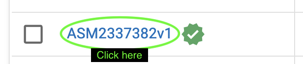
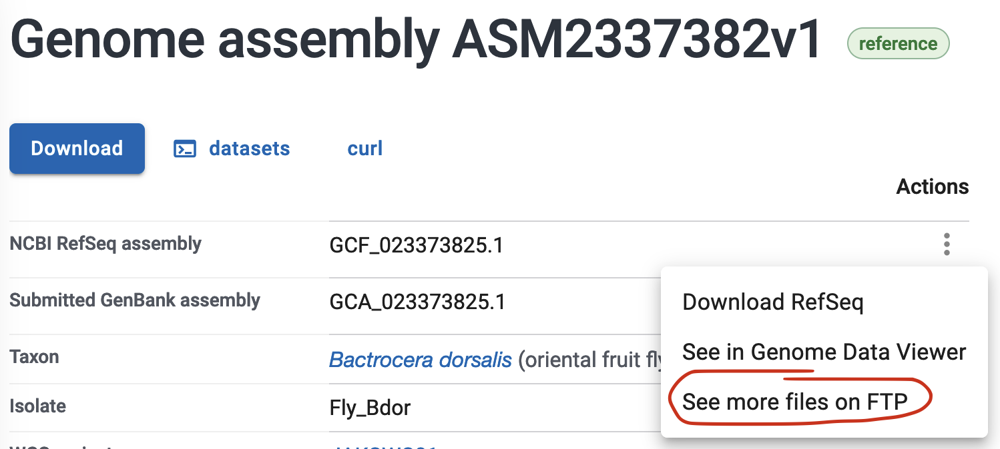
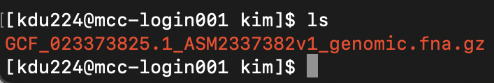

# Remote cluster (MCC)


## Connect
`ssh` (secure shell) establishes a connection from your computer to the cluster. You must have an account on the cluster in order to log in.

On your computer run `ssh user_name@mcc-dtn.ccs.uky.edu` 

The first time you connect to the cluster, you will get a message like this:


Type `yes` to continue.

After successfully logging in, the command line prompt will change to show that. It should look something like this `[user_name@mcc-login001 ~]$`

To disconnect from MCC, run `exit`

NB: Once you connect, you will be working with two computers: your local computer and the remote cluster. When running commands, pay attention to where your working directory is located (i.e., which computer you are working on.)

___

## Make your working directory on MCC
1. After logging on to MCC, go to our course directory <br>
 `cd /pscratch/jdu282_brazil_bootcamp2023/`

2. View the contents of the class directory with `ls`

3. Go into the "students" folder and make a new directory <br>
 `cd students`  <br>
 `mkdir your_name`

4. Run `ls` again. You should see a folder with your name. How do we know it’s a folder? The name is color-coded in blue.

___

## Transferring files 

### Copy files from your computer to the cluster
Your current working directory and local_file needs to be on your local computer.

If local_file is in your current working directory: <br>
`scp local_file user_name@server_address:/path/to/cluster/directory`

If local_file is in another directory: <br>
`scp /path/to/local_file user_name@server_address:/path/to/cluster/directory`

### Copy files from the cluster to your computer
Again, run the command from your local computer.

`scp user_name@server_address:/path/to/cluster/remote_file /path/to/local/directory`<br>

If the destination is the current working directory, the full path to the current working directory can be replaced with `.` <br>
`scp user_name@server_address:/path/to/cluster/file.txt .`

**_Question:_** How do you modify the `scp` command to copy a directory?

**_Task:_** Copy the `hello.txt` file you made previously from your computer to your folder on the cluster. Then delete the file from the cluster.

___

## Modules
Some programs are already installed on MCC, however, they need to be activated in order to work.

`module list` lists the activated programs onto your account.

`module avail` lists the programs installed on the cluster. Use `module avail | grep "program_name"` to search for a specific program (note that most module names are in lowercase).

`module load module_name` activates the program

`module unload module name` deactivates/removes the program from your account

___

## Singularities
These are like modules except that instead of loading them, the program name is called when you submit a job to the cluster.

The full list of singularity programs is [here](https://ukyrcd.atlassian.net/wiki/spaces/UKYHPCDocs/pages/72417975/Software+list+for+singularity+containers+for+conda+packages+in+the+MCC+cluster)

___

## Slurm job submission & batch scripts
MCC uses Slurm (Simple Linux Utility for Resource Management) to manage user demand and system resources. When you submit a job, what you're doing is requesting the use of computer processors (nodes). 

Commands, or "jobs", are submitted with batch scripts. Batch script files must end in `.sh` and must start with the following lines:

```
#!/bin/bash
#SBATCH --partition=        # Processor type
#SBATCH --time=             # How long you want to use the resources
#SBATCH --nodes=            # How many processors; typically 1
#SBATCH --ntasks=           # How many cores on the processor
#SBATCH --account=          # CPU hours are monitored and charged

Optional
#SBATCH --mail-type=ALL     # Notify when job starts/ends/fails
#SBATCH --mail-user=        # Your email address
```

To see what types of processors are available run `sinfo`
<p align="left">
  
</p>

The format for --time= is day-hour:minute:second, e.g., 00-01:00:00 means 1 hour.

NB: Notification emails often end up in spam/junk folders.

**_Task:_** In your folder on MCC, make a new file named "batch_header.sh" and add the following lines. We will use this file as a template for job submission.
```
#!/bin/bash
#SBATCH --partition=normal
#SBATCH --time 01-00:00:00
#SBATCH --nodes=1
#SBATCH --ntasks=32
#SBATCH --account=coa_jdu282_brazil_bootcamp2023
#SBATCH --mail-type ALL
#SBATCH --mail-user <your email address>
```

To submit a job run `sbatch your_batch_script.sh`

Once you submit a job, you can check its status with `squeue | grep mcc_user_name`. If all processors are in use, your job will wait until resources are available; `TIME 0:00` means your job has not started.


Each job gets a job number and a corresponding `slurm-job_number.out` file. This file has the information that is normally printed to the screen as the program is running. 

To cancel a submitted job use `scancel job_number` (get the job number from `squeue | grep mcc_user_name`)

NB: All data analysis should be submitted as a job. **Do not run jobs on the login node.**

___

## Getting data for read mapping and SNP calling with GATK
SNP calling from whole-genome (shotgun) sequence data requires a reference genome plus sequencing reads from multiple individuals to map to the reference and call SNPs from. 

We're going to use Bactrocera dorsalis (oriental fruit fly) whole-genome sequence data from [this paper](https://onlinelibrary.wiley.com/doi/full/10.1111/eva.13507).

### **_Task:_** download the _Bactrocera dorsalis_ reference genome from NCBI
We will download the latest Bactrocera dorsalis (oriental fruit fly) reference genome from NCBI (National Center for Biotechnology Information (USA)).

1. Search for "Bactrocera dorsalis" on https://www.ncbi.nlm.nih.gov/

2. Click on "Genomes" and then click on the genome with the green check (which is the latest reference genome).

<p align="left">
  
</p>

3. Ignore the big download button and instead navigate to the FTP server. You should be at https://ftp.ncbi.nlm.nih.gov/genomes/all/GCF/023/373/825/GCF_023373825.1_ASM2337382v1/



4. Right-click and copy the link for `GCF_023373825.1_ASM2337382v1_genomic.fna.gz`

5. In your folder on MCC type `wget` and then paste the link:
`wget https://ftp.ncbi.nlm.nih.gov/genomes/all/GCF/023/373/825/GCF_023373825.1_ASM2337382v1/GCF_023373825.1_ASM2337382v1_genomic.fna.gz`

6. After downloading, your folder should look something like this:
<p align="left">
  
</p>

___

### **_Task:_** get a copy of the individual sequencing read files (and submit your first cluster job!)
We will need to download shotgun reads for multiple individuals, which is a repetitive task (and the perfect opportunity to use a for loop).

Our data is from this [BioProject](https://www.ncbi.nlm.nih.gov/bioproject/PRJNA893460/), which has 237 individuals of shotgun data for _B. dorsalis_.

I've made a full list of the SRR accessions here: /pscratch/jdu282_brazil_bootcamp2023/data/Bdor_WGS_SRA_list.txt. You were all assigned a set of samples, to get the SRR accessions run <br>
`sed -n '<lower_number>,<upper_number>' /pscratch/jdu282_brazil_bootcamp2023/data/Bdor_WGS_SRA_list.txt`

Make a text file the lists your four SRR accessions.
1. Open the text editor by running `nano SRR_accessions.txt`
2. Enter your SRR accessions as a list
3. Save and exit nano `control+x`

To download from NCBI, we're going to need to use SRAtoolkit which is available [here](https://github.com/ncbi/sra-tools/wiki/01.-Downloading-SRA-Toolkit). It's already installed on the cluster so we'll use that version.

Make a copy of your batch script template <br>
`cp batch_header.sh SRR_download.sh`

Then open SRR_download.sh and add these lines to the file
```
container=/share/singularity/images/ccs/conda/amd-conda1-centos8.sinf
singularity run --app sratools2110 $container prefetch 

for f in `cat SRR_accessions.txt`; do singularity run --app sratools2110 $container prefetch $f.sra; done

for f in `cat [list of SRR accessions]`; do singularity run --app sratools2110 $container fastq-dump --outdir fastq --gzip --skip-technical  --readids --read-filter pass --dumpbase --split-3 --clip $f/$f.sra; done
```

Then submit your job `sbatch SRR_download.sh`. Assuming it starts right away, this should take about 40 minutes.