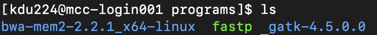

# Software

## Installation
The coding language a program is written in determines how the program is installed.

A program's **source code** is the human-readable instruction set that programmers write (e.g., Python, R, C, C++). **Binary** is the machine-readable version of source code, where 0’s and 1’s represent machine code that the CPU can run.

Programming languages can be broadly categorized into two types based on how they convert source code into binary.
* An interpreted language (e.g., Python, R) uses an interpreter which reads the source code line by line and executes each line as it is read. The interpreter translates the source code into machine code _at runtime_. 

* A compiled language (e.g., C, C++) is converted into machine code _before runtime_. During "compiling", a compiler program converts the source code into an executable file (a file that runs a program). The compiled code is optimized for the specific hardware and operating system of the machine on which it is intended to run, e.g., macOS with Intel processor.

### Compiled languages: installing from source code
This is the general process for installing from source code:
* Download the software package. They are often compressed in `.tar.gz` or `.gz` format; use `tar -xvf package.tar.gz` or `gunzip package.gz` to decompress.
* Go into the decompressed source code folder. There should be a file named "configure".
* In the source code folder, run `./configure` <br>
  * If you do not have root access permission to install programs, list a path to where you do have permission <br>
   `./configure --prefix=/installation/folder` <br>
   
* In the source code folder, run `make`
* In the source code folder, run `make install`
* There should now be a `bin` folder that has executable binaries for the program.
   * If you ran `./configure --prefix=/installation/folder`, the binaries will be in the specified folder.

### Interpreted languages and pre-compiled binaries
Interpreted languages do not require installation. Likewise, for compiled languages, if you're lucky a pre-compiled binary is available for your specific CPU architecture and operating system. 

If you have one of these, download and decompress the file, place the program/binary where you install programs, and you're ready to go! 

<p align="left">
  
</p>


NB: Keep your installed bioinformatics programs in a single place. On Linux and macOS that is typically `/usr/local/bin`, although I like to make a directory at `/usr/local/bin/programs` to keep my bioinformatics programs separate. On Windows make a directory in `C:\Program Files`. Regardless, make sure the directory is in your PATH.

___

## Updating your PATH
Environmental variables store information specific to your computer. Software can access these variables to know how things are set up on your computer. The `$PATH` variable specifies the directories where executable programs are located.

If a program is your PATH variable, you can call the program without having to type the full path.

E.g., instead of typing `/usr/local/bin/programs/bwa-mem2-2.2.1_x64-linux/bwa-mem2`, you can call the program by only typing `bwa-mem2` because your computer knows to look in /usr/local/bin/programs/bwa-mem2-2.2.1_x64-linux/ for programs.

PATH information is kept in your `.bash_profile` file located in your user directory.

To add a program to your PATH:
* Open .bash_profile `nano ~/.bash_profile`
* Add this line (update /path/to/program/directory/ with the information for your program)
    ```
    export PATH=$PATH:/path/to/program/directory/
    ```
* Save and exit nano `control + x`
* Refresh your command line shell by running `source ~/.bash_profile`

**Do not add the program itself to the path, just the directory the contains the program.**

The way $PATH works is that it tells the computer which directories to look in, not where to find specific files.

___

## Package managers
Package managers simplify software management by automating installation, configuration, and upgrades. They don't have every program but it's nice when they have the one you need. 

### Conda
Anaconda is a Python distribution with thousands of packages. Conda is the package manager for Anaconda. Instead of the complete Anaconda distribution, [Miniconda](https://docs.anaconda.com/free/miniconda/miniconda-install/) is a bare-bones version that comes with Conda, Python, and a few useful packages; if you're going to use Conda on your local computer, I suggest installing Miniconda.

In addition to package management, Conda is also an environment manager where you can create and manage virtual environments (isolated environments with different packages and versions of those packages). Environments need to be activated prior to use. 

To create a new Conda environment
```
conda create --name <environment name> python
```

Once the environment is created, you can activate it
```
conda activate <environment name>
```

When a conda environment is activated, the shell prompt will change to show that
<p align="left">
  
</p>

To install programs in a Conda environment run `conda install <program name>`

To see what programs are installed in a Conda environment run `conda list`

To exit the environment run `conda deactivate`

___

## Getting help
### The README

<p align="left">
  
</p>

Most programs come with a README file, a text file that documents how to use the program. It is often the first thing people look at when working with a new program.

Besides what the program does and how to use it, the README can have information on dependencies (additional software the program requires to function properly), installation instructions, and links to other resources (e.g., website or manual with detailed documentation).

Many basic questions about the program can be addressed by looking in the README (unless you have a poorly written one).

___

### `-h` or `--help`

Programs often have a `-h` or `--help` option that lists all the program's options.

**_Task:_** On your local computer, run `gunzip -h`. This lists all the options you can use to decompress a gzip file. 

___

## Installing programs and setting up the environment for read mapping and GATK SNP calling
**_Task:_** In your personal folder on the cluster, make a folder named "programs" `mkdir programs`. 
We will install the following in your programs folder.

### fastp
This program does read trimming, among other things. Fastp comes as a prebuilt binary, so no installation is required. We just need to download the file to the cluster and make sure it is accessible with `chmod`
1. Make sure you are in your `programs` folder.
2. Download the program `wget http://opengene.org/fastp/fastp`
3. Make the file executable by changing the permissions `chmod a+x ./fastp`

Add the fastp executable to your path (~/.bash_profile)
1. Open ~/.bash_profile `nano ~/.bash_profile`
2. Add this line to your .bash_profile (update \<user_name\> with your information):
    ```
    export PATH=$PATH:/pscratch/kdu224_iceland_bootcamps2024/students/<user_name>/programs
    ```
3. Save and exit nano `control + x`
4. Refresh your command line shell by running `source ~/.bash_profile`
5. Check that you installed fastp correctly by running `fastp`. You should see a list of program options (and no error messages!).


### BWA2
This is a popular read mapping (alignment) program. It also comes as a prebuilt binary, but this time the download is a tar.bz2 file, so we need to decompress it.
1. Make sure you are in your `programs` folder.
2. Download the program `wget https://github.com/bwa-mem2/bwa-mem2/releases/download/v2.2.1/bwa-mem2-2.2.1_x64-linux.tar.bz2`
3. Decompress the tarball `tar -xvf bwa-mem2-2.2.1_x64-linux.tar.bz2`
4. Add the path to the `bwa-mem2-2.2.1_x64-linux` directory to your ~/.bash_profile (hint: you just did this for fastp).
    ```
    export PATH=$PATH:/pscratch/kdu224_iceland_bootcamps2024/students/<user_name>/programs/bwa-mem2-2.2.1_x64-linux/
    ```
5. Check that your installation worked by running `bwa-mem2`

### bamUtil
This program modifies read mapping output files (BAM/SAM files). This time we're going to create a Conda environment for bamUtil. These steps can be done in a few different ways, but here we'll create an empty environment in a specific location, activate it, and then install bamUtils into that environment.
1. Make sure you are in your `programs` folder.
2. Load Conda `module load ccs/conda/python`
3. Create a new Conda environment named "bamUtil_env" `conda create --prefix /path/to/your/cluster/programs/folder/bamUtil_env python=3.9`
  * Replace /path/to/your/cluster/programs/folder/ with your information.
4. Activate the Conda environment you just made `conda activate /path/to/your/cluster/programs/folder/bamUtil_env`
  * Your prompt will change to look something like this:
    <p align="left">
      
    </p>
5. Install the bamUtil program `conda install -c bioconda bamutil`
6. Check that your installation worked by running `bam`
7. Exit the Conda environment `conda deactivate`

On the cluster, when you submit a job file that requires a Conda environment, load Conda before activating the environment. Otherwise, you'll get the error `-bash: conda: command not found`. The job script should look something like this:
```
module load ccs/conda/python
conda activate /path/to/your/cluster/programs/folder/bamUtil_env

<bamUtil commands>
```

### samtools
Samtools is already installed on the cluster, so all we need to do is load the module.
1. `module load samtools-1.12-gcc-9.3.0-zo3utt7`


### GATK
1. Make sure you are in your `programs` folder.
2. Download the program `wget https://github.com/broadinstitute/gatk/releases/download/4.5.0.0/gatk-4.5.0.0.zip`
3. Decompress the file `unzip gatk-4.5.0.0.zip`
4. Add the path to the `gatk-4.5.0.0` directory to your ~/.bash_profile (hint: you did this for fastp).
    ```
    export PATH=$PATH:/pscratch/kdu224_iceland_bootcamps2024/students/<user_name>/programs/gatk-4.5.0.0
    ```

GATK uses a Java wrapper to call commands, so instead of calling a .jar file, as you often do with java tools (e.g. `java --jar file.jar`), we can just call the wrapper as long as java is functioning (i.e., we need to load the cluster's Java module). We also need to load python.
1. `module load ccs/java/jdk-17.0.2`
2. `module load ccs/conda/python`
3. Check that your installation worked by running `gatk`

<br>
<br>
<br>

At this point your programs folder should have at least these files:
<p align="left">
  
</p>

Your ~/.bash_profile should look something like this:
```
export PATH=$PATH:/pscratch/kdu224_iceland_bootcamps2024/students/kim/programs/

export PATH=$PATH:/pscratch/kdu224_iceland_bootcamps2024/students/kim/programs/bwa-mem2-2.2.1_x64-linux/

export PATH=$PATH:/pscratch/kdu224_iceland_bootcamps2024/students/kim/programs/gatk-4.5.0.0/
```

These are the modules we will use:
```
module load ccs/conda/python
module load samtools-1.12-gcc-9.3.0-zo3utt7
module load ccs/java/jdk-17.0.2
```

And you should have a conda environment named `bamUtil_env`
```
conda activate /path/to/your/cluster/programs/folder/bamUtil_env
```

___

## Other things to know 

### Wildcards
Wildcards are symbols used to represent one or more characters in commands. They are useful for performing operations on multiple files or directories that **share a common pattern in their names**. 

Wildcards can be combined and used with various commands (e.g., ls, cp, mv, rm, etc.) to perform batch operations on files. It's important to use them carefully, especially in commands that modify or delete files, as they can affect a large number of files with a single command (again, command line does not have an "undo" function).

* Asterisk `*`: This is the most widely used wildcard. It represents any number of characters (including zero characters) in a filename or extension. For example:
  * `ls *.txt` lists all files in the current directory that have a .txt extension.
  * `cp *.jpg ~/pictures/` copies all JPEG files from the current directory to the "pictures" directory.
  * `rm *` deletes every file in the current directory (use with extreme caution).

* Question Mark `?`: This wildcard stands in for exactly one character. It's useful when you know the general pattern of the file names but want to match only those at a specific position. For example: `ls file?.txt` would list files like file1.txt, fileA.txt, but not file10.txt or file.txt.

### Symlinks
Symbolic links (symlinks, also known as soft links) are a type of file that points to another file or directory, similar to shortcuts in Windows or aliases in macOS. When you access a symlink, the operating system redirects you to the file or directory it points to.

To create a symlink, run:
```
ln -s /path/to/original/file name_of_symlink
```
This creates a symlink in the current working directory that points to /path/to/original.

To remove a symlink use `rm symlink`. This only removes the symlink and doesn't affect the target file.

### Permissions (Linux)
The MCC cluster uses Linux permissions (Windows has its own kind of permissions). Permissions are rules that determine who can access or modify files and directories. 

Types of permissions:

* Read (`r`): Grants the ability to read the contents of the file or list the contents of a directory.
* Write (`w`): Allows the file to be modified or new files to be created within a directory.
* Execute (`x`): Permits the execution of a file (like a script or a program) or access to a directory.
* `-` means no permission

User classes:
* User (`u`): The owner of the file or directory.
* Group (`g`): A set of users who belong to the same group. Each file/directory is associated with a group.
* Others (`o`): Everyone else who has access to the system.

To see file information run `ls -l`


Looking at the permissions we can see how they are broken down by user class. In this example, anyone (the user, group members, and outside the group) can read/write/execute the file (this is highly unsafe).

<p align="left">
  
</p>

The `chmod` command is used to set permissions. 
```
chmod [references][operator][modes] filename
```
The reference is the class (u, g, or o). The operator adds (+), removes (-) or explicitly sets (=) the particular permissions. The modes are read (r), write (w), or execute (x). 

For example, let's say we wanted to add user execute permissions to "file1". We would run `chmod u+x file1`

For more information see [here](https://kb.iu.edu/d/abdb).


___

## The bare minimum to remember
* How to install compiled programs from source code
* How to install executables and pre-compiled binaries
* ~/.bash_profile
* Conda
* In preparation for genotyping, we installed the programs fastp, BWA2, bamUtil, samtools, and GATK