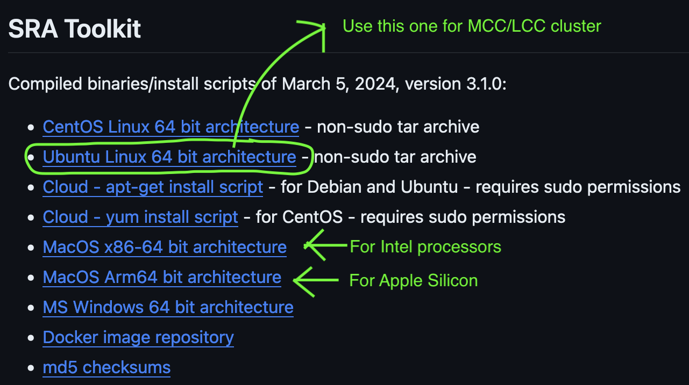
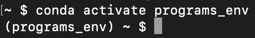
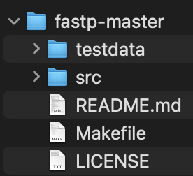
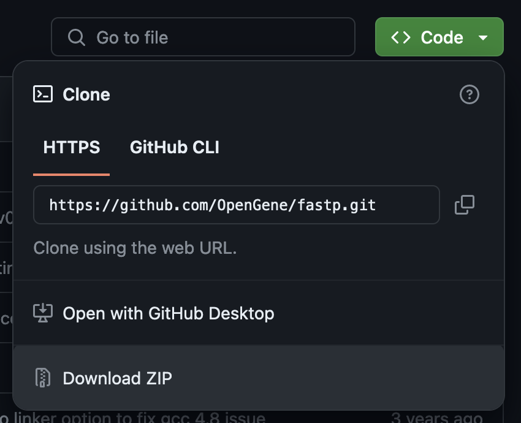

# Software

## Installation
The coding language a program is written in dictates how it is installed.

A program's **source code** is the human-readable instruction set that programmers write (e.g., Python, R, C, C++). **Binary** is the machine-readable version of source code, where 0’s and 1’s represent machine code that the CPU can run.

Programming languages can be broadly categorized into two types based on how they convert source code into binary.
* An interpreted language (e.g., Python, R) uses an interpreter which reads the source code line by line and executes each line as it is read. The interpreter translates the source code into machine code at runtime. 

* A compiled language (e.g., C, C++) is converted into machine code before runtime. During "compiling", a compiler program converts the source code into an executable file that can be run on the target machine. The compiled code is optimized for the specific hardware and operating system of the machine on which it is intended to run.

### Compiled languages: installing from source code
1. Download the software package. They are often compressed in `.tar.gz` format; use `tar -xvf package.tar.gz` to decompress.
2. Go into the decompressed source code folder. There should be a file named "configure".
3. In the source code folder, run `./configure` <br>
   If you do not have root access, make a folder where you have permission to install programs and specify the path to that folder <br>
   `./configure --prefix=/local/installation/folder` <br>
   
4. In the source code folder, run `make`
5. In the source code folder, run `make install`
6. There should now be a `bin` folder that has executable binaries for the program. <br>
   If you ran `./configure --prefix=/local/installation/folder`, the binaries will be in the specified folder.

### Interpreted languages and pre-compiled binaries
Interpreted languages do not require installation. Likewise, for compiled languages, if you're lucky a pre-compiled binary is available for your specific CPU architecture and operating system. 

If you have one of these, download and decompress the file, place the program/binary where you install programs, and you're ready to go! 



NB: Keep your installed bioinformatics programs in a single place. On Linux and macOS that is typically `/usr/local/bin`, although I like to make a directory at `/usr/local/bin/programs` to keep my bioinformatics programs separate. On Windows make a directory in `C:\Program Files`. Regardless, make sure the directory is in your PATH.

___

## Updating your PATH
Environmental variables store information specific to your computer. Software can access these variables to know how things are set up on your computer. The `PATH` variable (Windows, Linux, macOS) specifies the directories where executable programs are located.

Once in your PATH variable, you can call the program by name without having to type the full path.

E.g., instead of typing `/usr/local/bin/programs/bwa-mem2-2.2.1_x64-linux/bwa-mem2`, you can now call the program by only typing `bwa-mem2`

PATH information is kept in your `.bash_profile` file

To add a program to your PATH:
1. Open .bash_profile `nano ~./bash_profile`
2. Add this line
```
export PATH=/where/is/the/program/directory:$PATH 
```
3. Save and exit nano `control + x`
4. Refresh your command line shell by running `source ~/.bash_profile`

NB: Do not add the program itself to the path, just the directory the holds the program.

___

## Package managers
Package managers simplify software management by automating installation, configuration, and upgrades. They don't have every program but it's nice when they have the one you need. 

### Conda
Anaconda is a Python distribution with thousands of packages. Conda is the package manager for Anaconda. Instead of the complete Anaconda distribution, [Miniconda](https://docs.anaconda.com/free/miniconda/miniconda-install/) is a bare-bones version that comes with Conda, Python, and a few other useful packages.

In addition to package management, Conda is also an environment manager where you can create and manage virtual environments (isolated environments with different packages and versions of those packages). Each time you want to use the tools in an environment, you need to activate the environment.

To create a new Conda environment:
1. `conda create --name ENV_NAME python` 
2. `conda activate ENV_NAME`

Once the environment is created, you can call it anytime with step 2. When a conda environment is activated, the shell prompt will change to show that.
<p align="left">
  
</p>

To install programs in a Conda environment run `conda install PACKAGE_NAME`

To see what programs are installed in a Conda environment run `conda list`

To exit the environment run `conda deactivate`

___

## Getting help
### The README

<p align="left">
  
</p>

Most programs come with a README file, a text file that documents how to use the program. It is often the first thing people look at when working with a new program.

Besides what the program does and how to use it, the README can have information on system requirements (e.g., other software the program needs), installation instructions, and links to other resources (e.g., website or manual with detailed documentation).

Many basic questions about the program can be addressed by looking in the README (unless you have a poorly written one).

**_Task:_** Look at a README file and get an idea of what kind of information it contains. Download the program fastp [here](https://github.com/OpenGene/fastp). Unzip the file by clicking on it, and then open the resulting folder to find the README. 

<p align="left">
  
</p>

___

### `-h` or `--help`

Programs often have a `-h` or `--help` option that lists all the program's options.

**_Task:_** On the cluster, run `squeue -h`

___

## Installing programs and setting up the environment for read mapping and GATK SNP calling
In your folder on the cluster, make a folder named "programs" and install the following in that folder.

### fastp
This program does read trimming, among other things. Fastp comes as a pre-built binary, so no installation is required. We just need to download the files to the cluster and make sure they are accessible with `chmod`.

```
wget http://opengene.org/fastp/fastp
chmod a+x ./fastp
```

### BWA2
This is a popular read mapping (alignment) program. It also comes as a prebuilt binary, but this time the download is a tar.bz2 file, so we need to decompress it.

```
wget https://github.com/bwa-mem2/bwa-mem2/releases/download/v2.2.1/bwa-mem2-2.2.1_x64-linux.tar.bz2
tar -xvf bwa-mem2-2.2.1_x64-linux.tar.bz2 
```

### bamUtil
This program modifies read mapping output files (BAM/SAM files). This time we're going to create a conda environment for bamUtil. These steps can be done in a few different ways, but here we'll create an empty environment in a specific location, activate it, then install bamUtils into that environment.

```
module load ccs/conda/python
conda create --prefix /your/cluster/folder/bamUtil_env python=3.9
conda activate /your/cluster/folder/bamUtil_env
conda install -c bioconda bamutil
```

On the cluster, when you submit a job file that requires a Conda environment, include the line `module load ccs/conda/python` before the `conda activate` line. Otherwise, you'll get the error `-bash: conda: command not found`.

### samtools
Samtools is already installed on the cluster, so all we need to do is load the module.
```
module load samtools-1.12-gcc-9.3.0-zo3utt7
```

### GATK
```
wget https://github.com/broadinstitute/gatk/releases/download/4.5.0.0/gatk-4.5.0.0.zip
unzip 4.5.0.0.zip
```

GATK uses a Java wrapper to call commands, so instead of calling a .jar file, as you often do with java tools (e.g. `java --jar file.jar`), we can just call the wrapper as long as java is functioning (i.e., we need to load the cluster's Java module).

```
module load ccs/java/jdk-17.0.2
```

### Other things to know: Wildcards
Wildcards are symbols used to represent one or more characters in commands. They are useful for performing operations on multiple files or directories that **share a common pattern in their names**. 

Wildcards can be combined and used with various commands (e.g., ls, cp, mv, rm, etc.) to perform batch operations on files. It's important to use them carefully, especially in commands that modify or delete files, as they can affect a large number of files with a single command (again, command line does not have an "undo" function).

1. Asterisk `*`: This is the most widely used wildcard. It represents any number of characters (including zero characters) in a filename or extension. For example:
* `ls *.txt` lists all files in the current directory that have a .txt extension.
* `cp *.jpg /pictures` copies all JPEG files from the current directory to the /pictures directory.
* `rm *` would delete every file in the current directory (use this with extreme caution).

2. Question Mark `?`: This wildcard stands in for exactly one character. It's useful when you know the general pattern of the file names but want to match only those that have a specific character in a specific position. For example:
* `ls file?.txt` would list files like file1.txt, fileA.txt, but not file10.txt or file.txt.