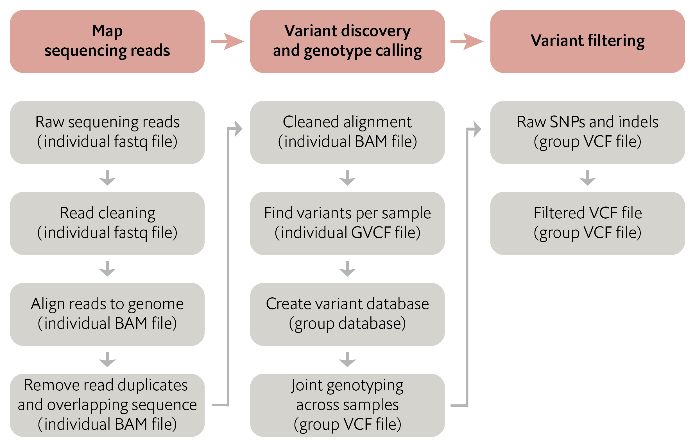
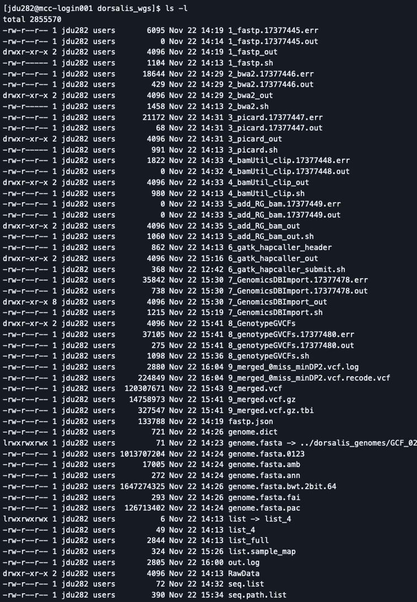
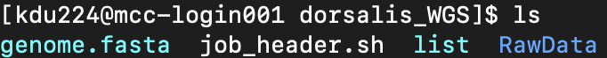

# SNP calling using GATK



You should have the subsetted _B. dorsalis_ read files from module 2, installed programs from module 3, and modified reference genome from module 4.

In general, the options we're using here follow the "GATK best practices". See [here](https://gatk.broadinstitute.org/hc/en-us/articles/360035894711-About-the-GATK-Best-Practices) and [here](https://gatk.broadinstitute.org/hc/en-us/sections/360007226651-Best-Practices-Workflows).

NB: With the subsetted read files, steps 1-5 take under 5 minutes to run (except step 2 which takes ~20). Step 6 takes ~1 hr or so, and steps 7 and 8 are around 15 minutes each.

_**Task:**_ In your folder on the cluster make a new folder named `dorsalis_WGS`.

_**Data management note:**_ This is a bit of a long process, so when I run it, I label my steps and files in order. I also have a directory called `RawData` where I store the raw data files or soft links to them. As you'll see, each step's output gets put in its own numbered directory. We will talk about each of these steps as we go along, but this approach leads to a directory structure like this where files (job submission file, output, and stdout/stderr) all group together by step:



<br>

_**Task:**_ This approach requires a few special items in the job submission file. 
1. Make a copy of your job_header.sh file `cp job_header.sh job_header_gatk.sh`
2. Modify the following in your job_header_gatk.sh file (you don't need to add the comments):
```
#!/bin/bash
#SBATCH --time 2:00:00     
#SBATCH --job-name=1_fastp    # Base name for the job submission file, and all related files
#SBATCH --nodes=1        
#SBATCH --ntasks=20      
#SBATCH --account=coa_jdu282_brazil_bootcamp2023  
#SBATCH --partition=normal
#SBATCH --mail-type ALL    
#SBATCH --mail-user your_email_address
#SBATCH --mem=8g
#SBATCH -e %x.%j.err     # Using %x in the -e and -o options applies the job name (from above) to these output files. %j does the same for job number
#SBATCH -o %x.%j.out
```
3. For convenience, move job_header_gatk.sh to your dorsalis_WGS folder `mv job_header_gatk.sh dorsalis_WGS/`

<br>

_**Task:**_ Add sequencing read files to the RawData folder.
1. Within your dorsalis_WGS folder make another folder named `RawData`
2. Enter the RawData folder 
3. Copy the subsetted _B. dorsalis_ read files from your fastq folder to the RawData folder. Since they all end in either `_1Mreads_R1.fastq` or `_1Mreads_R2.fastq`, we can use wildcards:
```
cp /path/to/your/fastq/folder/*.1Mreads.R1.fastq /path/to/your/RawData/folder
cp /path/to/your/fastq/folder/*.1Mreads.R2.fastq /path/to/your/RawData/folder
```
_**Question:**_ Why didn't we use *.fastq to move all the subsetted files in one command?

<details>
<summary>Answer</summary> 

The original sequencing read files also end in .fastq. If we used *.fastq, both the original and subsetted files would be copied to RawData, which we do not want.

</details>

<br>

Alternatively, we could have made symlinks to the read files
```
for f in `cat SRA_accessions.txt`; do ln -s /path/to/fastq/"$f".1Mreads.R1.fastq /path/to/RawData/"$f".1Mreads.R1.fastq; ln -s /path/to/fastq/"$f".1Mreads.R2.fastq /path/to/RawData/"$f".1Mreads.R2.fastq; done
```

<br>

_**Task:**_ In your dorsalis_WGS folder make a symlink named `genome.fasta` that links to the modified reference genome.
```
ln -s /path/to/GCF_023373825.1_ASM2337382v1_chromosomes_renamed.fa genome.fasta
```

<br>

_**Task:**_ In your dorsalis_WGS folder make a symlink named `list` that links to your SRA_accessions.txt file.
```
ln -s /path/to/SRA_accessions.txt list
```

<br>
<br>

At this point your dorsalis_WGS folder should have these files:
<p align="left">
  
</p>

___

## 1. Read cleaning (fastp)
Fastp does general read trimming (based on quality score, kmer analysis, etc.), and generates trimmed reads plus an html output.

1. In your dorsalis_WGS folder make a copy of your job_header_gatk.sh file named `1_fastp.sh`
2. Change the job name to `#SBATCH --job-name=1_fastp`
3. Add the job commands to the end of the file and submit:
```
mkdir 1_fastp_out

for f in `cat list`; do fastp --in1 ./RawData/$f.1Mreads.R1.fastq --in2 ./RawData/$f.1Mreads.R2.fastq --out1 ./1_fastp_out/$f.R1.fastpOut.fq.gz --out2 ./1_fastp_out/$f.R2.fastpOut.fq.gz  --detect_adapter_for_pe --trim_poly_g --thread 20 --overrepresentation_analysis --length_required 35 --compression 9 -h ./1_fastp_out/$f.html; done
```

Check out the html output to see what fastp can figure out for you.

___

## 2. Read mapping (BWA2)
BWA2 will map our processed reads, and do it very fast for this application.  We will also create reference genome index files (remember that earlier we made the soft link genome.fasta) for GATK, BWA2, and samtools (each program has their own specific format).
Here, samtools will sort the BWA2 alignment output files by chromosomal coordinates and convert from sam to bam format.

1. In your dorsalis_WGS folder make a copy of your job_header_gatk.sh file named `2_bwa2.sh`
2. Change the job name to `#SBATCH --job-name=2_bwa2`
3. Add the job commands to the end of the file and submit:
```
module load ccs/java/jdk-17.0.2
module load ccs/conda/python
module load samtools-1.12-gcc-9.3.0-zo3utt7

# Make genome index files (we'll use the gatk one later)
bwa-mem2 index ./genome.fasta
samtools faidx ./genome.fasta
gatk CreateSequenceDictionary R=genome.fasta O=genome.dict  #really a picard tool here

# Map sequencing reads to the reference genome
mkdir 2_bwa2_out
for f in `cat list`; do echo "starting bwa on $f" ; bwa-mem2 mem -t 20 -M ./genome.fasta ./1_fastp_out/$f.R1.fastpOut.fq.gz ./1_fastp_out/$f.R2.fastpOut.fq.gz > ./2_bwa2_out/$f.paired.sam; done

# Sort the alignment file and convert it from SAM to BAM format
for f in `cat list`; do echo "starting samtools on $f"; samtools view -b ./2_bwa2_out/$f.paired.sam | samtools sort --threads 20 -o ./2_bwa2_out/$f.bam;  done
```

You can see some of my for loops have a bit more progress checking built into them (the `echo` commands). Not a necessity, but it's sometimes nice to be able to track what specimens might be failing in a big list of data.

___

## 3. Remove duplicate reads (gatk MarkDuplicates)
This is another tool from picard that is now built into GATK (as of version 4). We will use [MarkDuplicates](https://gatk.broadinstitute.org/hc/en-us/articles/360037052812-MarkDuplicates-Picard-) to mark and remove duplicate reads. 

Duplicate reads are reads that originate from the same template molecule. 
* PCR duplicates are created during library prep, where PCR amplification preferentially amplifies certain DNA fragments, resulting in an excess of the same DNA fragment. 
* Optical duplicates result from the sequencer (e.g., Illumina) separating a single cluster (which represents a single DNA fragment) into two or more clusters, creating multiple duplicate reads.

 We don't want duplicate reads because (1) they provide redundant information which (2) artificially inflates read depth. See [here](https://bioinformatics.stackexchange.com/questions/2866/how-do-pcr-duplicates-arise-and-why-is-it-important-to-remove-them-for-ngs-analy).

1. In your dorsalis_WGS folder make a copy of your job_header_gatk.sh file named `3_picard.sh`
2. Change the job name to `#SBATCH --job-name=3_picard`
3. Add the job commands to the end of the file and submit:
```
mkdir 3_picard_out

module load ccs/conda/python
module load ccs/java/jdk-17.0.2

for f in `cat list`; do gatk MarkDuplicates I=./2_bwa2_out/$f.bam O=./3_picard_out/$f.dedup.bam M=./3_picard_out/$f.dupstats.txt VALIDATION_STRINGENCY=SILENT REMOVE_DUPLICATES=true SORTING_COLLECTION_SIZE_RATIO=0.1; done
```

___

## 4. Remove overlapping sequence (BamUtil clipOverlap)
The clipOverlap tool from BamUtil will clip overlapping read pairs from your paired end, mapped reads. See more [here](https://genome.sph.umich.edu/wiki/BamUtil:_clipOverlap). 

As with duplicate reads, we don't want overlapping sequences because they will artificially inflate read depth where the reads overlap.

1. In your dorsalis_WGS folder make a copy of your job_header_gatk.sh file named `4_bamUtil_clip.sh`
2. Change the job name to `#SBATCH --job-name=4_bamUtil_clip`
3. Add the job commands to the end of the file and submit:
```
module load ccs/conda/python
conda activate /path/to/your/cluster/folder/bamUtil_env

mkdir 4_bamUtil_clip_out

for f in `cat list`; do bam clipOverlap --in 3_picard_out/$f.dedup.bam --out 4_bamUtil_clip_out/$f.clipped.bam --stats; done
```
If you don't remember where your bamUtil_env conda environment is:
1. `module load ccs/conda/python`
2. `conda info --envs`

___

## 5. Add read group information (samtools addreplacerg)
Read groups are sets of reads that originate from the same source, e.g., the same sequencing lane, the same library prep method, or the same subpool in pooled libraries. And sometimes if you have multiple read groups, you might want to incorporate that information into SNP calling (e.g., when calibrating base score quality based on the data). 

So here we're applying a read group to the data. For our dataset, the authors didn't provide much information on subpooling or multiple sequencing lanes, so we're going to apply the same read group to all samples. If you had multiple read groups, you'd want each one to have a unique read group ID (`'-r ID:[name]`) and have different sample lists for each read group.

Finally we will index the individual bam files because it's required in the next step. 

1. In your dorsalis_WGS folder make a copy of your job_header_gatk.sh file named `5_add_RG_bam.sh`
2. Change the job name to `#SBATCH --job-name=5_add_RG_bam`
3. Add the job commands to the end of the file and submit:
```
module load samtools-1.12-gcc-9.3.0-zo3utt7

mkdir 5_add_RG_bam_out

# Add the same read group information for all samples in "list"
for f in `cat list`; do samtools addreplacerg -r ID:wgs -r LB:L1 -r SM:$f.clipped.bam -o ./5_add_RG_bam_out/$f.rg.bam ./4_bamUtil_clip_out/$f.clipped.bam; done

# Index bam files
for f in `cat list`; do samtools index ./5_add_RG_bam_out/$f.rg.bam; done
```

<br>
<br>

Ok, now onto the actual variant calling with GATK. There's a lot of ways to do this, depending on the size of the genome, number of individuals, how long you want it to take, etc. For our pipeline, the basic order of operations is:

* Step 6 calls variants across the whole genome for each individual and saves the data as `g.vcf` files. This step can be somewhat memory intensive and time consuming, so we get around this by submitting each individual as a separate job. <br>
For more information on HaplotypeCaller see [here](https://gatk.broadinstitute.org/hc/en-us/articles/360035531412-HaplotypeCaller-in-a-nutshell) and [here](https://gatk.broadinstitute.org/hc/en-us/articles/360037225632-HaplotypeCaller) (note that the `-ERC GVCF` approach ignores doing multiple individuals and does not create individual g.vcf files),

* Step 7 creates a database that stores variant information for all individuals organized by genomic coordinates. The problem is, this step is very memory intensive, and if your genome is big, even more so. Here, we do this analysis this one scaffold/chromosome at a time with a for loop, but for big scaffolds you could submit a job for each scaffold like we do in step 6. <br>
For more info on GenomicsDBImport see [here](https://gatk.broadinstitute.org/hc/en-us/articles/360036883491-GenomicsDBImport).

* Step 8 conducts joint genotyping across samples (all samples are genotyped for the same variants) and creates `VCF` files for each scaffold. In a final step the scaffold VCFs are combined into one final VCF file that has genotypes for all samples at the same loci across the genome. Step 8 is relatively simple, but is only needed when following steps 6 and 7 the way we are doing it here.

___

## 6. GATK HaplotypeCaller
To submit each individual sample as a separate job, we do this fancy job submission process where we have two files.

First, we have a header file. You can see it's basically the header from job_header_gatk.sh but with additional commands.
1. In your dorsalis_WGS folder make a file named `6_gatk_hapcaller_header`
2. Add the following (don't forget to add your email address):
```
#!/bin/bash
#SBATCH --time 2:00:00 
#SBATCH --job-name=6_gatk_hapcaller
#SBATCH --nodes=1
#SBATCH --ntasks=20
#SBATCH --account=coa_jdu282_brazil_bootcamp2023
#SBATCH --partition=normal
#SBATCH --mail-type ALL
#SBATCH --mail-user <your email address>
#SBATCH --mem=32g
#SBATCH -e %x.%j.err
#SBATCH -o %x.%j.out

module load ccs/conda/python
module load ccs/java/jdk-17.0.2
module load samtools-1.12-gcc-9.3.0-zo3utt7
```

Second, I have a simple bash file that has the commands.
1. In your dorsalis_WGS folder make a file named `6_gatk_hapcaller_submit.sh`
2. Add the following:
```
#!/bin/bash

mkdir 6_gatk_hapcaller_out

# This is a still a for loop
for f in `cat list`; 
do
echo $f
cat 6_gatk_hapcaller_header > 6_gatk_hapcaller.$f.sh
echo "gatk HaplotypeCaller --java-options "-Xmx24g" -R ./genome.fasta -I ./5_add_RG_bam_out/$f.rg.bam --native-pair-hmm-threads 3 -ERC GVCF -O ./6_gatk_hapcaller_out/$f.g.vcf"  >> 6_gatk_hapcaller.$f.sh
sbatch 6_gatk_hapcaller.$f.sh 
done
```

Third, instead of using sbatch to submit the job, we will execute our job script.
1. Make 6_gatk_hapcaller_submit.sh executable by running `chmod +x 6_gatk_hapcaller_submit.sh`
2. Run the script `./6_gatk_hapcaller_submit.sh`
3. Check `squeue | grep user_name`. You should have 4 jobs running.

_**Question:**_ Can you figure what this script is doing? Hint: we ran a single script but ended up with four running jobs.

<details>
<summary>Answer</summary> 

For each sample, we are creating and submitting new sample-specific job scripts by combining the header from 6_gatk_hapcaller_header with the gatk HaplotypeCaller command in 6_gatk_hapcaller_submit.sh. 

</details>

<br>

Using two files to create multiple jobs running simultaneously (instead of sequentially one at at time), is a pretty handy way to speed up analyses that are doing the same exact thing to multiple samples/libraries/etc. This is more-or-less the non-computer-sciency alternative to what are called job arrays, which we'll talk about later on with regard to amplicon data.

___

## 7. GATK GenomicsDBImport
To do step 7 for each chromosome individually, we can make a list that lists each scaffold.
1. In your dorsalis_WGS folder make a file named `seq.list`
2. Add the following:
```
Chromosome1
Chromosome2
Chromosome3
Chromosome4
Chromosome5
Chromosome6
```

You also need a file that refers to the locations of the g.vcf files created in step 6.
The sample map is a tab-delimited text file where each line is formatted: sample_name--tab--path_to_sample_vcf.

1. In your dorsalis_WGS folder run the following to create your `list.sample_map`
```
for f in `cat list`; do echo -e "$f\t/path/to/your/6_gatk_hapcaller_out/folder/$f.g.vcf" >> list.sample_map; done
```
Note the tab character `\t`.


The sample map should look similar to this:
```
SRR22045704	/scratch/jdu282/dorsalis_wgs2/6_gatk_hapcaller_out/SRR22045704.g.vcf
SRR22045731	/scratch/jdu282/dorsalis_wgs2/6_gatk_hapcaller_out/SRR22045731.g.vcf
SRR22045705	/scratch/jdu282/dorsalis_wgs2/6_gatk_hapcaller_out/SRR22045705.g.vcf
SRR22045735	/scratch/jdu282/dorsalis_wgs2/6_gatk_hapcaller_out/SRR22045735.g.vcf
```

And the job submission script would look like this:
1. In your dorsalis_WGS folder make a copy of your job_header_gatk.sh file named `7_GenomicsDBImport.sh`
2. Change the job name to `#SBATCH --job-name=7_GenomicsDBImport`
3. Add the job commands to the end of the file and submit:
```
module load ccs/conda/python
module load ccs/java/jdk-17.0.2

mkdir 7_GenomicsDBImport_out

# First for loop
for f in `cat list`; do gatk IndexFeatureFile -I ./6_gatk_hapcaller_out/$f.g.vcf; done

# Second for loop. Needs seq.list and list.sample_map files
for f in `cat seq.list`; do 
echo "Starting $f"
gatk --java-options "-Xmx48g -Xms48g" GenomicsDBImport --genomicsdb-workspace-path ./7_GenomicsDBImport_out/$f.db --batch-size 50 -L $f --sample-name-map ./list.sample_map -L $f --reader-threads 3
echo "Finishing $f"
done
```

You can see in that first for loop, we're indexing each `g.vcf` file (this could be done as a separate step or after the code in the previous step), and then in the second for loop (this one not in 1-line format and with some extra `echo`'s) we're creating the databases for each scaffold. 

Finally, make a copy of your `list.sample_map` file and place it in `/scratch/kdu224/bioinf_2024/sample_maps`. I will create a final VCF file that has everyone's samples for us to look at later. 

___

## 8. GATK GenotypeGVCFs and 9. Merging VCFs
Step 9 requires an input file that basically tells gatk where to find the scaffold-specific `vcf` files, which I call `seq.path.list`. Because we are consistent with our file naming, we can list the path to the output of step 8 even before running step 8.
1. In your dorsalis_WGS folder run the following to create your `list.sample_map`
```
for i in {1..6}; do echo "/path/to/your/8_genotypeGVCFs/folder/Chromosome"$i".vcf.gz" >> seq.path.list; done
```

It looks like this (but obviously will have different paths when you are doing this):
```
/scratch/jdu282/dorsalis_wgs2/8_GenotypeGVCFs/Chromosome1.vcf.gz
/scratch/jdu282/dorsalis_wgs2/8_GenotypeGVCFs/Chromosome2.vcf.gz
/scratch/jdu282/dorsalis_wgs2/8_GenotypeGVCFs/Chromosome3.vcf.gz
/scratch/jdu282/dorsalis_wgs2/8_GenotypeGVCFs/Chromosome4.vcf.gz
/scratch/jdu282/dorsalis_wgs2/8_GenotypeGVCFs/Chromosome5.vcf.gz
/scratch/jdu282/dorsalis_wgs2/8_GenotypeGVCFs/Chromosome6.vcf.gz
```

Here's what the job submission script looks like. The location option in the `-V gendb` option is a bit finicky, but written like this the job script needs to be in the same directory as `7_GenomicsDBImport_out` (but not in 7_GenomicsDBImport_out), which contains the output of step 7.

1. In your dorsalis_WGS folder make a copy of your job_header_gatk.sh file named `8_genotypeGVCFs.sh`
2. Change the job name to `#SBATCH --job-name=8_genotypeGVCFs`
3. Add the job commands to the end of the file and submit:
```
module load ccs/conda/python
module load ccs/java/jdk-17.0.2

mkdir 8_genotypeGVCFs

# Joint genotyping (step 8)
for f in `cat seq.list`; do
echo "Starting $f"
gatk --java-options "-Xmx48g" GenotypeGVCFs -R ./genome.fasta -V gendb://7_GenomicsDBImport_out/$f.db -O ./8_genotypeGVCFs/$f.vcf.gz 
echo "Finishing $f"
done

# Merging VCFs (step 9)
gatk MergeVcfs I=seq.path.list O=9_merged.vcf.gz
```

The final output is called `9_merged.vcf.gz`, and for a real dataset, this can be a big file (tens to hundreds of Gb). 

___

## 10. VCF filtering
VCFtools is a useful software for filtering and manipulating vcf files. It doesn't come as a pre-built binary, so we're going to have to install it like in the old days using configure, make, and make install. First let's download the software using git clone.

1. In your programs folder, download the software `git clone https://github.com/vcftools/vcftools.git`
2. Go into the vcftools folder
3. Now follow the instructions in the vcftools documentation:
```
./autogen.sh 
./configure --prefix=/path/to/your/programs/folder/vcftools
make
make install
```

Did it work? Sometimes it can be hard to figure out what error messages mean during installs. But in the error message above you should probably see a couple things mentioned: pkgconf and zlib. These are various compilers and other nitty gritty computer science dependencies of vcftools. Once you get used to seeing some of these names, you can often figure out if a cluster has other versions of the dependencies that might work better with vcftools. Let's search around and see if anything works.

4. Run the following: 
```
module spider pkgconf
module spider zlib
module load pkgconf-1.7.4-gcc-8.4.1-h4hnvr7
module load zlib-1.2.11-gcc-8.4.1-b4szoqs
```
5. Repeat `3.`
6. Add the `bin` folder to your ~/.bash_profile


Finally, let's filter this 4 individual, 1M reads dataset and we can talk about it as a group:
```
vcftools --vcf 9_merged.vcf --remove-indels --max-missing 1.0 --minDP 2 --recode --out 9_merged_0miss_minDP2.vcf
```

