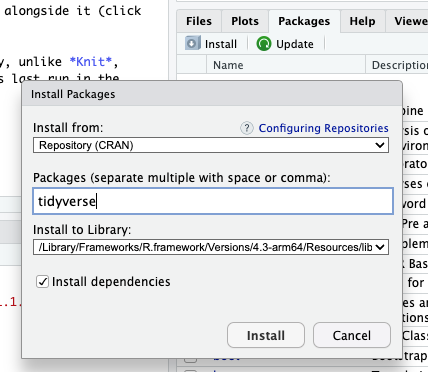

# RStudio basics

If you do not already have R, download it [here](https://cran.rstudio.com/). <br>
Download RStudio [here](https://posit.co/download/rstudio-desktop/).

We'll be working in RStudio, an integrated development environment (IDE) that among other things, has places to write and run code.
<p align="left">
  
</p>

The upper-left panel is the code editor for writing and editing code.

The lower-left panel is the console where R evaluates code. If you run code in the code editor, the code is automatically sent to the console, but you can also work in the console itself.

The upper-right panel has session-specific information tabs.
* "Environment" lists all of the data objects you have made in the current session. 
* "History" contains an archive of all the commands you’ve run in the current session.

The lower-right panel has navigation tabs. 
* "Files" displays your hard drive’s file directory for easy access to files. 
* "Plots" shows the visualizations you have created in your current session.
* "Packages" lists all installed packages and indicates which are loaded in the current session. 
* "Help" is, unsurprisingly, the help menu.

___

## R projects
An R project keeps all the files associated with a project together (e.g., scripts, data, output figures).

**_Task:_** Make a new R project in your "examples" folder (on your local computer) by following the steps below:
<p align="left">
  
  
  
  
</p>

Once you create the project, the upper right corner of your RStudio screen should look like this:
<p align="left">
  
</p>

The R project folder should have a .Rproj file with a cube icon. Whenever you want to work on this project, click on this icon and it will automatically launch RStudio, set the working directory to the project folder, and reopen the environment to where you left off including the files you had open.
<p align="left">
  
</p>

___

## R Markdown / R Notebooks
[Markdown](https://www.markdownguide.org/) (.md), is a way to annotate plain text so that it can be converted to fancier formatted (rich) text (e.g., bold text, subscripts, font sizes). R Markdown uses Markdown but it also has code chunks where you can embed and run code. This makes it easy to convert (knit) .Rmd files to rich text formats like Microsoft Word or HTML and create documents that have formatted text, code, and code output.
<p align="left">
  
</p>

<p align="left">
  
</p>

R Notebooks are a special type of R Markdown document that is specific to RStudio. There are several differences, but perhaps the most obvious is in how you can preview the final formatting.

In an R Notebook, you can preview the final formatting (except for the code output) without having to knit.
<p align="left">
  
</p>

Whereas in R Markdown you have to knit the file before you can see what it will look like.
<p align="left">
  
</p>

Both R Markdown and R Notebooks are .Rmd files; what differentiates an R Notebook is the `output: html_notebook` in the header.
```
---
title: "R Notebook example"
output: html_notebook
---
```

### File structure
**_Task:_** Create a new notebook.
<p align="left">
  
</p>

Notice that the file contains three types of content:
* An YAML header bounded by `---` (optional).
* R code chunks bounded by `` ``` ``.
* Text mixed with Markdown formatting.

<p align="left">
  
</p>

The metadata at the top of the file (between the --- lines) contains information about the file and instructions on how to knit the document. 

Code chunks can be executed within the notebook; the output is displayed beneath the code. Chunks start with `` ```{r}  `` and end with `` ``` ``. 
* To make a new chunk, type `control (windows)/command (macOS) + option + i` 
* To run a code chunk, press the green arrow at the right end of the chunk or place the cursor anywhere in the chunk and press `control (windows)/command (macOS) + Shift + Enter`. 
* To run a **specific line of code** within a code chunk, move the cursor to the desired line and press `control (windows)/command (macOS) + Enter`.

**_Task:_** Run the default code chunk in your notebook. A graph should appear below the eechunk.


Text in an .Rmd file is in plain text, however, we can add [markdown annotations](https://www.markdownguide.org/basic-syntax/) which create formatted text (bold, italics, links, etc.) when the .Rmd file is converted into a rich text file (HTML, PDF, Microsoft Word, etc.)
<p align="left">
  
</p>

### Error messages
Code chunks have useful features to help with debugging.

If RStudio detects typos like a missing character or spelling errors, a little red x appears next to that line of code. This is very helpful since it indicates which line has the mistake. 
<p align="left">
  
</p>

The other way R reports errors is through error messages. Furthermore, the code will stop running at that line and you can get an idea of where the error is by looking at the progress bar next to the code. 
<p align="left">
  
</p>


### HTML output
By default, an HTML version of the notebook is saved with the notebook file.

Why do I care about an HTML version of my notebook? Because everyone can access a web browser. This makes it easy to share your results and it is possible to extract the original notebook from the HTML file.

**_Task:_**  View your notebook in HTML. Save the notebook and then open the project folder (hint: use the "Files" tab in the lower right of the RStudio screen). The folder should have a file with the same name as your notebook but ending in `nb.html`. Click on the nb.html file and it will open in a web browser.
<p align="left">
  
</p>

___

## Installing packages
R packages are a way to share code and data. How a package is installed depends on where it is available.

First, is the package on [CRAN](https://cran.r-project.org/)?

**_Task:_**  Install the Tidyverse R package from CRAN. <br>
* To use the RStudio interface, click on the "Packages" tab in the lower-right panel, click on the "Install" tab, search for "Tidyverse", and then click "Install". Make sure the "Install dependencies" box is checked.
<p align="left">
  
</p>

* Alternatively, to install packages from the console (lower-left panel), run:
```
install.packages("tidyverse")
```

Second, is the package not on CRAN but is on Github? This will require the `devtools` package (hint: this package is on CRAN).

```
load(devtools)
install_github("DeveloperName/PackageName")
```

NB: When installing a package from the console, the package name must be in quotes. Once installed, the package can be called without quotes. 

Packages are installed once, but they need to be loaded for each R session. In a .Rmd document, it is good practice to have the first code chunk be the one that loads all necessary packages.

**_Task:_** Load Tidyverse into your session's environment.
```
library(tidyverse)
```

Packages typically come with documentation. To learn more about a package, search the `help` tab in the lower-right panel or run `?packageName` in the console.

___

## Some R basics
### Variables


### Functions
In general, functions in R follow this format:
```
function()
```
Where "function" is the name of whatever function/operation you're doing and within the parentheses you spell out all of the parameters, inputs/outputs, and options for the given function.

If you're not sure what options a function has, you can do the following:
```
??function
```
This will open up a web browser and get you to an info page about functions (you will have to click on the individual function in question in the browser to get to the info page; if there are multiple functions with the same name (i.e. from different libraries), you'll have to pick the right one from the list that pops up in your browser).


### Loading files
To load any type of data, you need to use a function that can read the data type (table, csv, etc.) and save the information as a data object.
```
my_data <- read_function(data_file_location, function options)
```

A common task is to import a CSV (comma-separated values) file, which is a plain text file that uses commas to separate data:
```
sample1, observation1.1, observation1.2
sample2, observation2.1, observation2.2
```

There are several ways to import a CSV file. For all methods, the path to the CSV file must be in quotes. By default, the first row is assumed to be the column names. 
* Use the `read.csv()` function that comes with base R (i.e., it doesn't need to be installed).
```
my_data <- read.csv("/path/to/csv/file")
```
* Use the `read_csv()` function in the readr package (2-3x faster than read.csv)
```
library(readr)
my_data <- read_csv("/path/to/csv/file")
```

