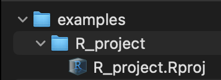
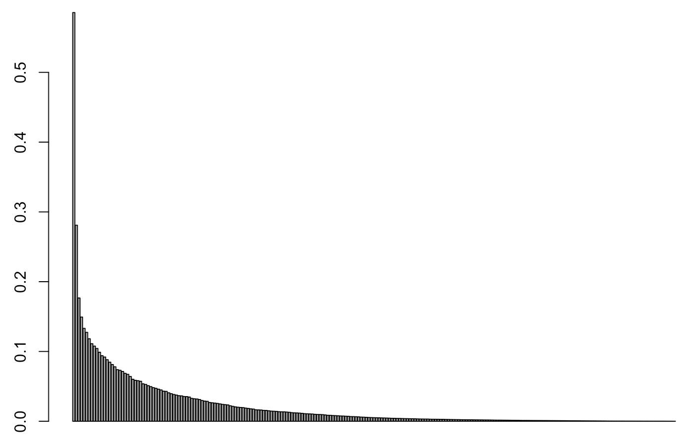
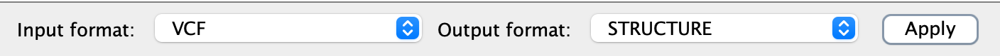
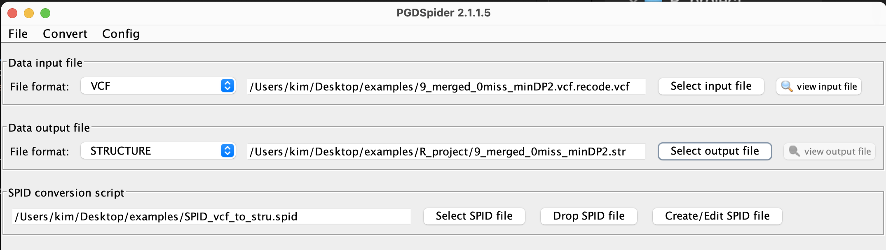

 # Population genetics analyses 

## Getting started

First, download the files we will need from the course data folder on MCC `/pscratch/kdu224_iceland_bootcamps2024/data` to your R_project folder on your local computer. Hint: use `scp` with wildcards to get files with similar names.
* 9_merged_0miss_minDP2_100ind_5245snps.vcf
* 9_merged_0.5miss_minDP1_100ind_257618snps.vcf
* Bdor_populations.sed
* Bdor_africa_sample_list.txt
* Bdor_asia_sample_list.txt
* swallowtail_ABBC_781ind_10microsat.str
* swallowtail_ABBC_strata.txt

Second, launch your RStudio R project (i.e., click on the .Rproj file)
<p align="left">
  
</p>

Third, we need to tell R where the files are that we want to read, and we do so by setting the "working directory" or "wd" with `setwd()`, for example `setwd("/Users/julian/Desktop/examples/R_project")`

However, since we are working in an R project, setwd is already set to the project folder.

Finally, let's load the programs we will need (you may need to install them first).
```
library(adegenet)
library(hierfstat)
library(pegas)
```

___

## Adegenet GENIND objects
Adegenet is a program for marker analysis and it uses data in GENIND (population GENetic data for INDividuals) format.

Adegenet comes with some nice toy datasets that we can use as examples. Load one of adegenet's toy datasets called nancycats, which is a bunch of microsatellite data for cat populations from Nancy, France (hence the fun name).
```
data("nancycats")
```

Once you have run that data() function, the nancycats dataset is loaded into memory, and you can access it by simply entering tne name of the dataset.
```
nancycats
```
There you should see the following output:
```
/// GENIND OBJECT /////////

 // 237 individuals; 9 loci; 108 alleles; size: 150.5 Kb

 // Basic content
   @tab:  237 x 108 matrix of allele counts
   @loc.n.all: number of alleles per locus (range: 8-18)
   @loc.fac: locus factor for the 108 columns of @tab
   @all.names: list of allele names for each locus
   @ploidy: ploidy of each individual  (range: 2-2)
   @type:  codom
   @call: genind(tab = truenames(nancycats)$tab, pop = truenames(nancycats)$pop)

 // Optional content
   @pop: population of each individual (group size range: 9-23)
   @other: a list containing: xy 
```
This tells you that nancycats is what's called a GENIND object in R, and it gives you some basic info (number of individuals, loci, alleles, etc.). Within this object you have both allele/genotype data and some other info. 

You can access different sets of info stored within this object by referring to the name of the data set (nancycats) with the `@` symbol and whatever other info you want to see. For example, `nancycats@ploidy` returns a list of the ploidy of all individuals in the dataset (there are 237 individuals, and they're all diploid, so relatively boring).

### @pop
The @pop subobject contains a list of the populations that each individual belongs to. So the following will give you a list of 237 population assignments with rather arbitrary population names ("P01", "P02", etc.)
```
nancycats@pop
```

### @tab
The @tab subobject contains counts of all alleles in all individuals, so if you entered "nancycats@tab" that would return a 237 row x 108 column block of text. We can access just the first 6 lines of that by also using the head() function.
```
head(nancycats@tab)
```
From that output, you can see that that the rows are individuals (with individual identifier numbers that start with "N") and columns are locus.allele combinations. So "fca8" is a locus name, and it is a dinucleotide repeat microsatellite, with alleles of size 117 bp, 119 bp, 121 bp, etc. all the way to 149 bp. After locus fca8 is locus fca23, and on and on. 

Another way to subset that big block of data from @tab is to use square brackets `[ ]` to pull out specific rows and/or columns by their number (e.g., row 1, row 2, column 1). The format is `[row_number,column_number]`. You can also combine that square bracket subsetting with calling individual loci from the GENIND object. 
```
nancycats[10:18, loc="fca8"]@tab  
```
10 refers to number of rows being displayed, 18 to the number of columns displayed, and then the only locus being called is fca8 from the @tab subobject (note, the row and column headers are included in those 10 and 18 numbers).

These are allele counts, so if you look at the row for individual N224, you can see it has 0s for all entries except a 2 in column fca8.135, so this individual has two copies of the 135 bp allele for this locus (it's a homozygote). Individual N7 is a heterozygote for alleles 137 and 141. 

___

## Load STRUCTURE file into adegenet
Ok, now onto another big task in doing this kind of analysis. Dealing with data that isn't already loaded into R! We'll be working with microsatellite genotype data from swallowtail butterflies in Alberta (AB) and British Columbia (BC) Canada, however, you would use the same steps for SNP data.

Note: We'll focus on .str format, but realize there are a bunch of other formats for microsatellite genotypes (genepop, FSTAT, etc.). <See converting file section>


Adegenet has a `read.structure()` function to read in our STRUCTURE file.

1. Run `swallowtail_data <- read.structure("swallowtail_ABBC_781ind_10microsat.str")`
2. The read.structure() function has lots of options to specify, but if you don't supply any options it will actually walk you through some of these options. See if you can answer the questions that read.structure is asking you.
3. Press control + c to cancel this process.
4. Alternatively, it's a little quicker to just specify that info in the function options.
    ```
    swallowtail_data <- read.structure("swallowtail_ABBC_781ind_10microsat.str", n.ind=781, n.loc=10, onerowperind=T,  row.marknames=NULL, col.lab=1, col.pop=2, NA.char="-9", ask=F)
   ```

### Strata
Strata refers to population stratification factors such as population location or breed information, so anything that can break up the individuals into different "populations". See more [here](https://raw.githubusercontent.com/thibautjombart/adegenet/master/tutorials/tutorial-strata.pdf).

Adegenet provides an easy way to deal with these different "population levels", which it refers to as strata.

The "swallowtail_ABBC_strata.txt" file contains some additional information about these individuals and populations. Let's read it into R using read.table() and take a look.
```
swallowtail_strata <-read.table("swallowtail_ABBC_strata.txt", header=T)
head(swallowtail_strata)
```

You can see it has the same individual names, their population codes, a region code, and lat and long. It'd be great to be able to use some of this info, so let's take this data and add it to the @other accessor for the swallowtail_data object. 
```
# First we can double check the @other tab is empty
swallowtail_data
swallowtail_data@other

# Then we can write the strata data to @other
other(swallowtail_data) <- swallowtail_strata

# And double check that it worked
swallowtail_data          # There should be a new @other accessor
swallowtail_data@other    # Now @other has data
```

The populations in @pop are listed as numbers (population codes). Let's change that to the population names. To switch @pop to the population names, we first need to take the information in @other and make it into a data frame object, and then we can assign that data frame to the strata accession within the genind object.
```
# Take the information in @other and make it into a data frame object
strata_df <- data.frame(other(swallowtail_data))

# Assign that data frame to the strata accession
strata(swallowtail_data) <- strata_df

# And double check that it worked!
swallowtail_data           # There should be a new @strata accessor
swallowtail_data@strata    # Now @strata has the data found in @other
```

Alternatively, we could skip loading data into @other and read it directly into @strata. 
```
strata(swallowtail_data) <- swallowtail_strata[,2:3]
```

Also, we can read in specific columns into strata. We can set the strata by referring to the columns in @other (pop and region). Remember the square brackets allow us to refer to rows and columns (in that order) within a dataframe, so pop and pop_name are columns 2 and 3, and we can apply both by using a colon (i.e. take columns 2 to 3 from swallowtail_strata and set them as strata).
```
strata(swallowtail_data) <- swallowtail_strata[,2:3]
```

Regardless, once we have the data stored in @strata, we can switch between strata by setting the @pop to different vectors within @strata.
```
#So now we can change the strata
setPop(swallowtail_data) <- ~ pop_name
swallowtail_data@pop    # Now the GENID object has population names instead of numbers
```

Note that the methods used here require the sample names in the STRUCTURE file and the strata data file to be in the same order.

___

## Principal component analysis
Let's start with a Principal Components Analysis (PCA). This is an unsupervised method for assessing population structure where we don't provide any population information; it is an exploratory tool to get an idea of population structure. 

A PCA takes large datasets with many variables and uses matrix algebra to find a smaller set of unrelated variables that capture the most variation in the original dataset (principal components). Principal components are typically ranked from highest to lowest explanatory power; the first principal component holds the most variance in the data.

Each principal component has a pair of values:
* The Eigenvector provides the direction of variance.
* The Eigenvalue is the coefficient of the eigenvector and represent the amount of variance the PC explains.

In a PCA scatterplot, the X and Y axes are different principle components (often the 1st and 2nd highest PCs). The x-axis represents the first principal component (PC1). The position of a point along this axis shows the score of that particular data sample on PC1. A higher absolute value on this axis indicates a stronger presence of the features that PC1 represents. Likewise for the y-axis and PC2.

Points that are close to each other have similar PC1 and PC2 scores, indicating that they are similar with respect to the most significant variance patterns in the dataset.

There are many ways to do a PCA, but since we have genetic data we will use the package [Adegenet](https://adegenet.r-forge.r-project.org/files/tutorial-basics.pdf).


### Missing data
First, we have to deal with the missing data in this dataset (missing alleles are noted as `-9`), since PCAs will not work with missing data. A standard way to deal with missing data in ordination methods is to replace any missing data values with the mean allele frequency for that locus.

```
# We can count how many missing values are in this dataset
sum(is.na(swallowtail_data$tab))

# Replace the missing values with mean frequencies
swallowtail_data_alleles_noNA <- tab(swallowtail_data, freq = TRUE, NA.method = "mean")

# Now the dataset should not have missing data
sum(is.na(swallowtail_data_alleles_noNA$tab))
```

### PCA
Now we can do the PCA on this object we just created. Some of the options in this statistical analyses are above our paygrade in this class, so I won't be going through all the options for each of these.

```
pca1 <- dudi.pca(df=swallowtail_data_alleles_noNA, center=TRUE, scale=FALSE)
```

A plot should appear that looks like this
<p align="left">
  
</p>

Let's think about these PCs a bit. So remember that the PCs are basically imaginary axes of variation in multivariate data. So these axes represent imaginary ranges of variation when you consider all the loci at once. PC1 explains the most variation, PC2 the second most, etc. etc.

In this plot the x-axis are the principal component dimensions and the y-axis is how much of the variance they contain. To choose the number of principal components, I look for where additional PCs start to contribute negligible amounts of variance (in this case around PC5), or you could choose as many PCs as you want to explore.

```
Select the number of axes: 
5
```

Now take a look at our `pca1` object
```
pca1
```

It should look like this:
```
Duality diagramm
class: pca dudi
$call: dudi.pca(df = X, center = TRUE, scale = FALSE)

$nf: 5 axis-components saved
$rank: 235
eigen values: 0.5857 0.281 0.1766 0.1494 0.1331 ...
  vector length mode    content       
1 $cw    246    numeric column weights
2 $lw    781    numeric row weights   
3 $eig   235    numeric eigen values  

  data.frame nrow ncol content             
1 $tab       781  246  modified array      
2 $li        781  5    row coordinates     
3 $l1        781  5    row normed scores   
4 $co        246  5    column coordinates  
5 $c1        246  5    column normed scores
other elements: cent norm 
```
Lots of info in there. Of particular interest are:
* `$eig` which are the eigenvalues of the analysis (the amount of variance explained by each PC)
* `$li` the PCs themselves, which are synthetic variables summarizing the genetic diversity
* `$c1` loadings of individual alleles, representing contributions to the PCs

Next up, let's look at the PCs:
```
# In raw form
head(pca1$li)

# And then plotted
s.label(pca1$li)

# And let's add the eigenvalue info to the plot
add.scatter.eig(pca1$eig[1:20], 3,1,2)

```

So the PC values themselves are basically just where individuals are falling along the axes of variation for each PC. So you can basically treat pairs of those PC values as X,Y coordinates (that's what plotted in the plot). You can even look at different pairs than just PC1 and PC2:
```
s.label(pca1$li,1,3)
```

By default the first plot we made plotted PC1 vs. PC2 (pca1$li,1,2), and now we're plotting PC1 vs. PC3, so the placement of individuals on the Y axis has changed, but their placement on the X axis hasn't (although that's hard to tell with those big name boxes). Let's make that plot a bit more informative by putting population names on there with ellipses and lines to connect each population's individuals:
```
s.class(pca1$li, pop(swallowtail_data))
```

Now it's a bit easier to see the differences between PCs:
```
s.class(pca1$li, pop(swallowtail_data),xax=1,yax=3)
```

Here's where you can lose your mind in the plotting options in R. A simple example:
```
col <- funky(50)
s.class(pca1$li, pop(swallowtail_data),xax=1,yax=2, col=transp(col,.6), axesell=FALSE, cstar=0, cpoint=3, grid=FALSE)
title("PCA of ABBC swallowtails\naxes 1-2")
add.scatter.eig(pca1$eig[1:20], 3,1,2)
```

You can see that many of these populations are grouping together, so let's explore that regional information. Let's set the strata to region_name and replot the PCA with the updated population strata.
```
# Add the region columns to @strata (we could have done this earlier when we loaded the strata data)
strata(swallowtail_data) <- swallowtail_strata[,4:5]

# Change @pop to region_name data 
setPop(swallowtail_data) <- ~ region_name

# Just to double check
pop(swallowtail_data)

# Replot
s.class(pca1$li, pop(swallowtail_data))
```

This dataset actually contains 2 species (zel and mach) from multiple regions, and in some areas these 2 species hybridize (particularly in parts of the Foothills region).

___

## Isolation by distance
In nature isolation by distance is the result of limited gene flow, where the probability of gene flow between 2 populations is a function of the geographical distance between them.

What about IBD in this dataset? The use of actual lat long values in R is a bit complicated, so this is just for funsies.

```
library(hierfstat)
setPop(swallowtail_data) <- ~ pop
genD <- genet.dist(swallowtail_data, method = "Fst") # calculate genetic distance
latlong <- swallowtail_strata[c('lat','long')] # access lat long coordinates from the other file
latlong_unique <- unique(latlong) # remove duplicates (since we're calculating distances for pairs of populations, not individuals)
library(geosphere)
library(sna)
geoD_temp1 <- distm(latlong_unique[c('lat','long')],fun=distVincentyEllipsoid) # calculate a geographic distance from those lat longs
geoD_temp2 <- geoD_temp1/1000 # turn it from meters to kilometers
geoD <- as.dist(upper.tri.remove(geoD_temp2, remove.val=NA)) # remove upper triangle of matrix to get it into dist class
ibd <- mantel.randtest(genD,geoD, nrepet=10000) # calculate the ibd
ibd
plot(geoD,genD)
dist_lm <- lm(as.vector(genD) ~ as.vector(geoD))
abline(dist_lm, col="red", lty=2)
```

So do we see a pattern of IBD in this dataset?

___

## Fst
The fixation index (Fst) is a measure of genetic differentiation between two or more populations.
Values range from 0 to 1. If Fst = 0, there is no genetic distance between populations. If Fst = 1, the two populations are very strongly separated.

Let's calculate FST. There are a lot of packages to do this, so let's explore a few. 

### First, we can use a simple function wc() in the library hierfstat.
```
??wc
wc(nancycats)
```
From the ??wc manual page, you can see under Value that the output of this function also creates some additional data that isn't shown by the default output.
```
wc(nancycats)$per.loc
```

### The library pegas can also calculate FST (as well as the other F-statistics) with the Fst() function.
```
??Fst
Fst(nancycats)
```
Well that didn't work, and the error message isn't terribly informative. If you look at the ??Fst manual page, you might notice that it requires an object of class "loci", and we're trying to give it an object of class "genind", so that's probably our issue. But pegas gives us a way around that with the following command:
```
??as.loci
Fst(as.loci(nancycats))
```

From both of those manual pages, you can see both hierfstat and pegas are calculating Weir and Cockerham's FST, so theoretically those outputs should be the same. Let's see if we can isolate the FST values from the rest of the output from those two functions and compare them in a scatterplot like we did with heterozygosity last week. Try this out on your own and when everyone's to this point we can work through it together on the screen.

<details>
<summary>Answer</summary>
plot(Fst(as.loci(nancycats))[,2], wc(nancycats)$per.loc$FST)

</details>

### Genomic Fst
Genetic divergence between populations may also vary along a genome. For example, two populations may be genetically very similar across much of their genomes except at a few strongly divergent regions. These divergent regions may therefore contain adaptive genes enabling the two populations to adapt to different environments. So it would be interesting to examine if genetic divergence between populations varies along the genome.

To do this, you first need to define the members of each population. We did this in the PCA section where you identified cluster membership, but here we will use collection data.

We will use `vcftools` to calculate Fst. To do this, vcftools determines the allele counts across all samples, then determines the allele counts for the specified populations, and finally compares the two allele counts to determine Fst  (Kim: check this is right)

We installed vcftools on the the computing cluster when we did the genotyping pipeline. Submit the following command as a job on MCC (set `#SBATCH --ntasks=1`):
```
vcftools --vcf 9_merged_0miss_minDP2_100ind_5245snps.vcf --weir-fst-pop Bdor_africa_sample_list.txt --weir-fst-pop Bdor_asia_sample_list.txt --out 9_merged_0miss_minDP2_100ind_5245snps
```

After the job is completed, the end of the slurm file should have something like this:
```
After filtering, kept 100 out of 100 Individuals
Outputting Weir and Cockerham Fst estimates.
Weir and Cockerham mean Fst estimate: 0.021124
Weir and Cockerham weighted Fst estimate: 0.06383
After filtering, kept 5245 out of a possible 5245 Sites
```

Now that we have locus Fst values, lets make a Manhattan plot, which plots the loci in order along the genome.

Download the .weir.fst file to your R Project folder.

First we need to rename chromosomes to numbers. On your local computer run:
```
sed 's/Chromosome//g' 9_merged_0miss_minDP2_100ind_5245snps_WC_Fst.weir.fst > 9_merged_0miss_minDP2_100ind_5245snps_WC_Fst.weir.fst.edited
```

Then in RStudio, run:
```
library(qqman)

# Set the working directory
#setwd("/path/to/project/folder")    # Not necessary if you're already in the project folder

fst <- read.table("9_merged_0miss_minDP2_100ind_5245snps_WC_Fst.weir.fst.edited",sep='\t',header=TRUE)

# Remove nan values
fst_noNA <- na.omit(fst)

# Add snp column. 
# Because this data does not include snp name, we will add dummy names.
# We do this by assigning a number to each snp.
length_ <- dim(fst)[1]
length_
fst$SNP <- paste('SNP',1:length_)

# Generate the manhattan plot
manhattan(fst,chr='CHROM',bp='POS',
          p="WEIR_AND_COCKERHAM_FST",snp='SNP',
          logp=FALSE,ylab='WEIR AND COCKERHAM_FST',xlab='CHR')
```

This...doesn't look like what you see in publications. Why do you think that is?

<details>
<summary>Answer</summary> 
Our VCF file only has a few thousand SNPs. Out of millions of bases, it's going to be hard to see our snps.

</details>

<br>

Let's remake the Manhattan plot with a VCF file that was filtered less stringently and thus has more snps `9_merged_0.5miss_minDP1_100ind_257618snps.vcf`

Once you have a Manhattan plot you are happy with, here are some options to highlight aspects of the data:
```
# Change the colors of the plot
manhattan(fst,chr='CHROM',bp='POS',
          p="WEIR_AND_COCKERHAM_FST",snp='SNP',col=c("blue", "orange"),
          logp=FALSE,ylab='WEIR AND COCKERHAM_FST',xlab='CHR')


# Annotate SNPs based on their fst values. 
# We do that by specifying a threshold using the annotatePval parameter
# By default, qqman only annotates the top SNP per chromosome that exceeds the threshold.
# Here, let's annotate snps with fst values 0.7
manhattan(fst,chr='CHROM',bp='POS',
          p="WEIR_AND_COCKERHAM_FST",snp='SNP',col=c("black", "red"),
          logp=FALSE,annotatePval = 0.7,annotateTop = TRUE)

# Highlight all hits. To do that, we change the annotateTop parameter to False
manhattan(fst,chr='CHROM',bp='POS',
          p="WEIR_AND_COCKERHAM_FST",snp='SNP',col=c("black", "red"),
          logp=FALSE,annotatePval = 0.7,annotateTop = F)

# Add a genomewide line.
manhattan(fst,chr='CHROM',bp='POS',
          p="WEIR_AND_COCKERHAM_FST",snp='SNP',col=c("black", "red"),
          suggestiveline = F,genomewideline = 0.5,logp=FALSE,ylab='WEIR AND COCKERHAM_FST',xlab='CHR')


# Highlight snp(s) of interest
# Look for the green dots in the plot
snps_of_interest=c("SNP 1422","SNP 20367","SNP 7412")
manhattan(fst,chr='CHROM',bp='POS',
          p="WEIR_AND_COCKERHAM_FST",snp='SNP',col=c("black", "red"),
          logp=FALSE,ylab='WEIR AND COCKERHAM_FST',xlab='CHR',highlight=snps_of_interest)
```

___

## Extra:How to convert from VCF to STRUCTURE format

Download our VCF file `9_merged_0miss_minDP2_100ind_5245snps.vcf`

Let's use [PGDSpider](http://cmpg.unibe.ch/software/PGDSpider/index.htm) to convert our VCF file.

1. Download PGDspider [here](http://cmpg.unibe.ch/software/PGDSpider/index.htm).
2. If you don't already have Java, download it [here](https://www.java.com/en/) (make sure that it is version 8).
3. Let's use the GUI.
```
Windows: execute the file "PGDSpider2.exe" to start the program

Linux: execute the command "./PGDSpider2.sh" to start the program

Mac and others: execute the command "java -Xmx1024m -Xms512m -jar PGDSpider2.jar" to start the program
```
4. PGDspider requires a SPID file where you tell it how to convert the file. Let's make that first.

<p align="left">
  
</p>

<p align="left">
  
</p>

Use the default settings and click the "Save and apply" button.

5. Now we will convert our file. Note that the .str file is going to be saved in your R project directory.
<p align="left">
  
</p>

_**Question:**_ How would you convert this file using the command-line option?

<details>
<summary>Answer</summary> 

`java -Xmx1024g -Xms512g -jar PGDSpider2-cli.jar -inputfile 9_merged_0miss_minDP2.vcf.recode.vcf -outputfile 9_merged_0miss_minDP2.str -spid SPID_file`

</details>

<br>

### Adding population information
Take a look at the structure file. The first row lists all the SNPs (starting at column 3).

Subsequent lines have the genotype information for each sample. In those rows, column 1 is the sample name, column 2 is the sample's population, and the genotypes start on column 3.

All the samples currently have the same population designation in column 2 ("1"). Let's update that information.

In the data folder is a file named "Bdor_populations.sed" download that file and run
```
sed -f Bdor_populations.sed 9_merged_0miss_minDP2.str > 9_merged_0miss_minDP2_pops.str
```
_**Question:**_ What is this sed command doing? Hint: open the file Bdor_populations.sed

<details>
<summary>Answer</summary> 
It is telling the computer to use the file Bdor_populations.sed to process 9_merged_0miss_minDP2.str and save the output as 9_merged_0miss_minDP2_pops.str.
<br>
<br>
If you look inside Bdor_populations.sed, you will see a list of sed find-and-replace commands, for example "s/SRR22045704	   1/SRR22045704    10/g;". What this command is saying is find every occurnace of "SRR22045704	   1" and replace it with "SRR22045704    10", where 10 is the population of the sample.

</details>

<br>


Now when you look at 9_merged_0miss_minDP2_pops.str, column 2 should have country codes.

| Country      | Population code |
| ------------ | --------------- |
| Burundi      | 1               |
| China        | 2               |
| Comoros      | 3               |
| India        | 4               |
| Kenya        | 5               |
| Madagascar   | 6               |
| Malawi       | 7               |
| Malaysia     | 8               |
| Mauritius    | 9               |
| Mayotte      | 10              |
| Reunion      | 11              |
| SriLanka     | 12              |
| Thailand     | 13              |

We could have also used the country names as populations.

___

## Summary
* Adegenet GENID objects
* PCA analyses
* Fst analyses