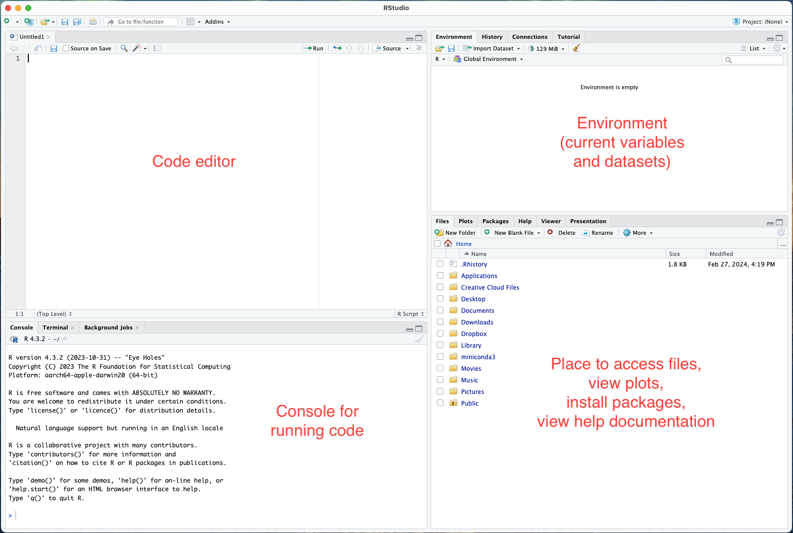
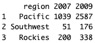
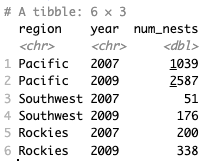
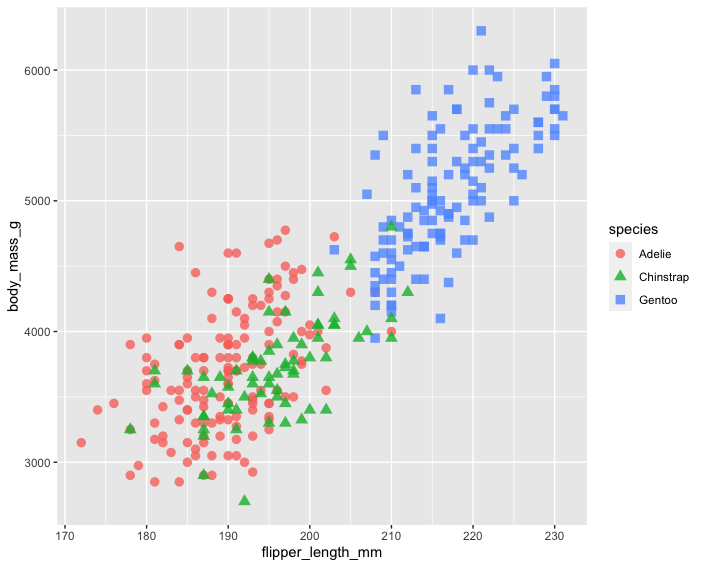
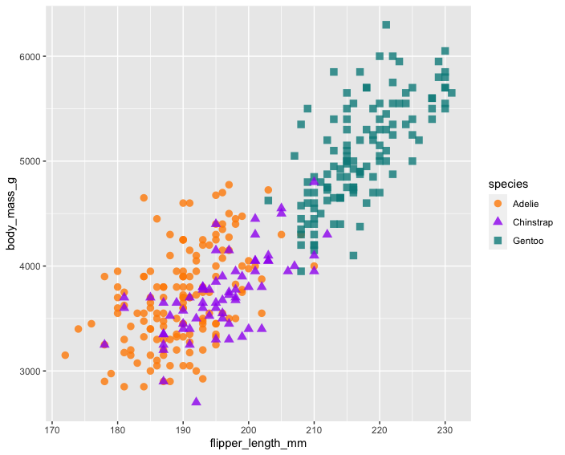
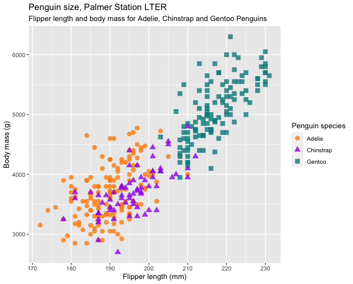
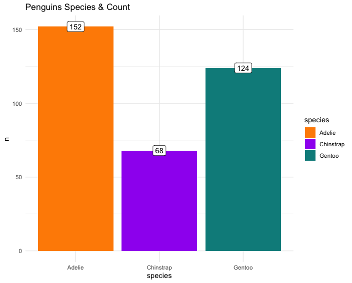

# Introduction to Tidyverse

## Getting started
If you do not already have R, download it [here](https://cran.rstudio.com/). <br>
Download RStudio [here](https://posit.co/download/rstudio-desktop/).

A helpful (and free) resource is ["R for Data Science" (2nd edition)](https://r4ds.hadley.nz/)

R is a "programming environment for statistics and graphics". One of its strengths is that we can easily expand R's functionally by installing additional code and data (R packages).

We'll be working in RStudio, an integrated development environment (IDE) that among other things, has places to write and run code.
<p align="left">
  
</p>
___

## Tidy data with tidyr

**_Task:_** Load Tidyverse into your environment.
```
library(tidyverse)
```

The [Tidyverse](https://www.tidyverse.org/) is “an opinionated collection of R packages designed for data science. All packages share an underlying design philosophy, grammar, and data structures.”

Practically, it is a group of R packages for data manipulation, exploration, and visualization.

Key to the Tidyverse system is the tidy data format, where:

* Each variable has its own column.
* Each observation has its own row.
* Each value has its own cell.

<p align="left">
  
  
</p>


Let's read in some data and see what this means. Copy and paste the following into a code chunk and run the chunk:
<!--https://dcl-wrangle.stanford.edu/pivot-basic.html-->

```
eagle_nest_data <- data.frame(
  "region" = c("Pacific", "Southwest", "Rockies"),
  "2007" = c(1039, 51, 200),
  "2009" = c(2587, 176, 338),
  check.names=FALSE
)

print(eagle_nest_data)
```



The variables in this dataset are region, year, and nests.

* Region is tidy because all of the data is in a single column. 
* Year is not tidy because the values (2007, 2009) are in two different columns.
* Nests is not tidy because the values are stored as values of 2007 and 2009.

Now we'll make the data tidy with the pivot_longer( ) function.

```
eagle_nest_data %>%             # Step 1 
  pivot_longer(
    cols = c(`2007`, `2009`),   # Step 2
    names_to = "year",          # Step 3
    values_to = "num_nests"     # Step 4
  )
```

* Step 1: `%>%` (magrittr) is a pipe that forwards a value into an expression or function. Think of it as saying "AND THEN".
* Step 2: Select the columns to pivot. We are going to take these columns and split the column names and data into two separate columns. 
* Step 3: Make a new column that will store the names of the selected columns.
* Step 4: Make a new column for the values of the selected columns.




The table now has more rows but each variable (region, year, nests) has a column and each data point has its own row. 

<br>

`tidyr` is the Tidyverse package for wranging data into a tidy format. Two important tools are the `pivot_longer()` and `pivot_wider()` functions.

`pivot_longer()` moves data from column names to cell values.

`pivot_wider()` moves data from cell values into column names, creating a wider data frame.

<br>

**_Task:_** `relig_income` is a dataset that comes with `tidyr`. Make it tidy.
* First, view the first few rows of the data by running `head(relig_income)`.

* Second, complete the following code by filling in the quotation marks. Hint: Income is a variable. Are the income values column names or cell values? Also, `cols = -religion` means "all columns that are not named 'religion'".

```
relig_income %>%
  pivot_longer(cols = -religion, names_to = "   ", values_to = "   ")
```
<!--pivot_longer(cols = -religion, names_to = "income", values_to = "frequency")-->
___

## Data manipulation with dplyr

<p align="left">
  
&nbsp; &nbsp; &nbsp; &nbsp; &nbsp; &nbsp; &nbsp;
  
</p>

For some reason R logos are hexagon-shaped.

<br>

Now let's see what we can do with tidy data. Within the `palmerpenguins` R package is the `penguins` dataset, a collection of size measurements for adult foraging penguins near Palmer Station, Antarctica.

**_Task:_** Install and load the necessary data and analysis packages:
```
install.packages("palmerpenguins")
library(palmerpenguins)
library(tidyverse)
```

Run `names(penguins)` to see the column names. To learn more about the variables, run `?penguins`.

FYI
<p align="left">
  
</p>


Let's answer the question "What is the mean body mass for female and male Adelie penguins on Dream island?"

```
penguins %>%
  select(species, island, body_mass_g, sex) %>%         # Step 1
  filter(species == "Adelie" & island == "Dream") %>%   # Step 2
  group_by(sex) %>%                                     # Step 3
  summarise(mean_body_mass = mean(body_mass_g)) %>%     # Step 4
  drop_na()                                             # Step 5
```

* Step 1: Select the desired variables (columns).
* Step 2: Filter the `species` data to only have Adelie and filter the `island` data to only include Dream island.
* Step 3: Group the `sex` data by categories (male and female).
* Step 4: Summarize the `body_mass_g` data which we already grouped by sex.
* Step 5: Drop NA values.

The output indicates that on Dream island, the mean body mass for Adelie penguins is 3344 grams for females and 4046 grams for males


`dplyr` is the Tidyverse package for data manipulation. All of the functions we used to answer our question about Adelie penguins came from this package.

___


## Data visualization with ggplot
 In terms of coding, ggplot has a highly systematic syntax. The ggplot() function is supplemented with other functions that control the objects and appearance of the plot. 
 
 Any figure made with ggplot has three elements:
 * Data
 * Aesthetics (`aes`)
 * Geometry (`geom`)
 
 <p align="left">
  
</p>

<br>

Let's visualize the relationship between `flipper_length_mm` and `body_mass_g`.

The first step is to call the ggplot() function and specify the dataset.
```
ggplot(data = penguins)
```

 Geometry refers to the geometric objects of a data visualization. They are the things that get drawn, e.g., lines, points, and bars. In ggplot the object determines the plot type, so for a line graph you call `geom_line`, for a scatter plot call `geom_point`.

```
ggplot(data = penguins) +
  geom_point()
```
 
 NB: Unlike Python, R does not care about code indentation.
 
 But geometric objects have attributes, e.g., color, size, position. These attributes can be linked to the data, e.g., a point size that is proportional to the number of individuals. The `aes()` function connects data to objects.

```
ggplot(data = penguins, aes(x = flipper_length_mm, y = body_mass_g)) +
  geom_point()
```

Here we specified which variables to use for our scatter plot. Note that aes() always goes inside another function.
 
 <p align="left">
  
</p>

We know that the data observations include species; that's information that we can feature in the plot.

```
ggplot(data = penguins, aes(x = flipper_length_mm, y = body_mass_g)) +
  geom_point(aes(color = species, shape = species))
```

By default, a legend is created when objects are connected to data.

 <p align="left">
  
</p>


These points are hard to see. Let's make them bigger and transparent. We'll add appearance information to geom_point(), however, because size and transparency are not related to data (here they are just settings), note that they are listed *outside* of the aes() function.

```
ggplot(data = penguins, aes(x = flipper_length_mm, y = body_mass_g)) +
  geom_point(aes(color = species, shape = species), size = 3, alpha = 0.8)
```

 <p align="left">
  
</p>

Hmm, I don't like these colors. Let's change them.
```
ggplot(data = penguins, aes(x = flipper_length_mm, y = body_mass_g)) +
  geom_point(aes(color = species, shape = species), size = 3, alpha = 0.8) +
  scale_color_manual(values = c("darkorange","purple","cyan4"))
```
 <p align="left">
  
</p>


And of course we'll need some labels. 
```
ggplot(data = penguins, aes(x = flipper_length_mm, y = body_mass_g)) +
  geom_point(aes(color = species, shape = species), size = 3, alpha = 0.8) +
  scale_color_manual(values = c("darkorange","purple","cyan4")) +
  labs(title = "Penguin size, Palmer Station LTER", 
    subtitle = "Flipper length and body mass for Adelie, Chinstrap and Gentoo Penguins", 
    x = "Flipper length (mm)",
    y = "Body mass (g)",
    color = "Penguin species",
    shape = "Penguin species")
  ```
 <p align="left">
  
</p>


ggplot has [themes](https://ggplot2.tidyverse.org/reference/ggtheme.html) that control non-data plot aspects like background color, grid appearance, etc.

```
ggplot(data = penguins, aes(x = flipper_length_mm, y = body_mass_g)) +
  geom_point(aes(color = species, shape = species), size = 3, alpha = 0.8) +
  scale_color_manual(values = c("darkorange","purple","cyan4")) +
  labs(title = "Penguin size, Palmer Station", 
    subtitle = "Flipper length and body mass for Adelie, Chinstrap and Gentoo Penguins", 
    x = "Flipper length (mm)",
    y = "Body mass (g)",
    color = "Penguin species",
    shape = "Penguin species") +
  theme_minimal()
  ```
 <p align="left">
  
</p>

Note that there are [many other ggplot functions](https://rstudio.github.io/cheatsheets/html/data-visualization.html) besides `geom()` and `aes()`. We called `scale_color_manual()` to change the point colors and `labs()` to add plot labels. Almost every aspect of a plot can be edited.

<br>

To demonstrate the flexibility of ggplot, let's make a different figure. Note how similar the code from the last plot is with this one:

```
species_count_data <- penguins %>% count(species)

ggplot(data = species_count_data, aes(x = species, y = n)) + 
  geom_col(aes(x = species, y = n, fill = species)) +
  geom_label(aes(x = species, y = n, label = n)) +
  scale_fill_manual(values = c("darkorange","purple","cyan4")) +
  labs(title = 'Penguins Species & Count') +
  theme_minimal()
  ```
 
 <p align="left">
  
</p>