# Determining population structure with STRUCTURE
STRUCTURE uses allele frequency data and Bayesian clustering models to probabilistically assign individuals to populations/genetic clusters. Populations are characterized by a set of allele frequencies at each locus. Individuals can have mixed ancestry from multiple populations (admixture), and STRUCTURE will estimate the genomic proportion that originates from each population. Unlike [ADMIXTURE](https://dalexander.github.io/admixture/index.html), known (prior) information about individual location or population of origin can be included in the analysis.

The goal is to infer the most likely number of populations `K` that explain the observed genetic variation. STRUCTURE estimates the posterior probability for different values of K; these are compared to determine the smallest K value that captures the data's structural patterns.

--> When to use STRUCTURE vs ADMIXTURE <--

Download STRUCTURE [here](https://web.stanford.edu/group/pritchardlab/structure_software/release_versions/v2.3.4/html/structure.html). Find the manual [here](https://web.stanford.edu/group/pritchardlab/structure_software/release_versions/v2.3.4/structure_doc.pdf). Another useful manual is the supplemental to [Porras-Hurtado et al. (2013)](https://www.frontiersin.org/journals/genetics/articles/10.3389/fgene.2013.00098/full).

___

## Terminology
`K` is the number of populations/genetic clusters.

`Q` is the admixture proportion. A `Q-matrix` contains the estimated membership proportions (Q values) for each individual in each of the K populations. Each row in the Q-matrix corresponds to an individual, and each column corresponds to a population.
* These proportions are values between 0 and 1 and sum to 1 across the K populations for each individual. For example, if there are 3 inferred populations (K = 3) and an individual has membership proportions of 0.7, 0.2, and 0.1, this means that the individual is estimated to have 70% of their ancestry in the first population, 20% in the second population, and 10% in the third population.

`X` is the genotypes of the sampled individuals (the data).

`Pr(X|K)` is the posterior probability, the probability of the observed genetic data `X` given a particular number of populations `K`.
* `lnPr(X|K)` and `lnP(K)` refer to the likelihood.

___
## Analysis settings
This is a brief summary of section 3 of the STRUCTURE manual, "Modelling decisions for the user". Some quotes are from Porras-Hurtado et al. (2013).

### Ancestry Models
* `No admixture model` "This model is appropriate for studying fully discrete populations and is often more powerful than the admixture model at detecting subtle structure."

* `Admixture model` "We recommend this model as a starting point for most analyses. It is a reasonably flexible model for dealing with many of the complexities of real populations."

* `Linkage model` "performs better than the original admixture model when using linked loci to study admixed populations ... The model is not designed to deal with background LD between very tightly linked markers." Requires information about the relative positions of the markers.

* `Using prior population information`. "use information about sampling locations: either to assist clustering with weak data, to detect migrants, or to pre-define some populations".
  * `LOCPRIOR`. "use sampling locations as prior information to assist the clustering--for use with data sets where the signal of structure is relatively weak."
  * `USEPOPINFO`
    * "use sampling locations to test for migrants or hybrids--for use with data sets where the data are very informative."
    * "pre-specify the population of origin of some individuals to assist ancestry estimation for individuals of unknown origin."

### Allele frequency models
* `Independent allele frequencies model` "ancestral relationships between clusters is not expected".

* `Correlated allele frequencies model` "provides extra flexibility allowing increased power to detect distinct populations even when they are closely related due to recent shared ancestry".

___

## Parameter files
See the STRUCTURE manual and Porras-Hurtado et al. (2013) for parameters and what they mean.

STRUCTURE has a specific format for input genotype files (.str or .stru). [PGDSpider](https://academic.oup.com/bioinformatics/article/28/2/298/198891?login=false) can convert many different genotype file formats to STRUCTURE format.
* Note that population data (the second column of the input file) must be integers, not strings.

### mainparams
The mainparams file is where you specify details about the input file and the STRUCTURE analysis. We will run STRUCTURE on multiple K values with multiple replicates for each value, however, the mainparams file specifies what to do for each replicate.

According to the STRUCTURE manual (page 13):
* BURNIN: "Typically a burnin of 10,000-100,000 is more than adequate."
* NUMREPS: "Typically, you can get good estimates of the parameter values (P and Q) with runs of 10000-100,000 steps, but accurate estimation of Pr(X|K) may require longer runs."

```
KEY PARAMETERS FOR THE PROGRAM structure.  YOU WILL NEED TO SET THESE
IN ORDER TO RUN THE PROGRAM.  VARIOUS OPTIONS CAN BE ADJUSTED IN THE
FILE extraparams.


"(int)" means that this takes an integer value.
"(B)"   means that this variable is Boolean 
        (ie insert 1 for True, and 0 for False)
"(str)" means that this is a string (but not enclosed in quotes!) 

Data File

#define INFILE Alud_ddRAD_179ind_0.2miss_3minDP_0.01maf_noInDels_biAllelic_5425snps_wildLocalitiesFam10Tap7Wil_popNum.stru   // (str) name of input data file
#define OUTFILE XXX  //(str) name of output data file

#define NUMINDS   179   // (int) number of diploid individuals in data file
#define NUMLOCI   5425   // (int) number of loci in data file
#define LABEL     1     // (B) Input file contains individual labels
#define POPDATA   1     // (B) Input file contains a population 
                             identifier
#define POPFLAG   0     // (B) Input file contains a flag which says 
                              whether to use popinfo when USEPOPINFO==1
#define PHENOTYPE 0     // (B) Input file contains phenotype information
#define EXTRACOLS 0     // (int) Number of additional columns of data 
                             before the genotype data start.
#define PHASEINFO 0     // (B) the data for each individual contains a line
                                  indicating phase
#define MARKOVPHASE  0  // (B) the phase info follows a Markov model.

#define MISSING      -9 // (int) value given to missing genotype data
#define PLOIDY       2  // (int) ploidy of data

#define ONEROWPERIND 0  // (B) store data for individuals in a single line
#define MARKERNAMES  1  // (B) data file contains row of marker names
#define MAPDISTANCES 0  // (B) data file contains row of map distances 
                             // between loci


Program Parameters

#define MAXPOPS    20    // (int) number of populations assumed
#define BURNIN    50000 // (int) length of burnin period
#define NUMREPS   100000 // (int) number of MCMC reps after burnin

Command line options:

-m mainparams
-e extraparams
-s stratparams
-K MAXPOPS 
-L NUMLOCI
-N NUMINDS
-i input file
-o output file
```

### extraparams
In this example we are using 
* Admixture model (NOADMIX=0).
* Correlated allele frequencies model, which is better for closely related populations.
* Prior population information to assist clustering (LOCPRIOR with LOCISPOP).

```
EXTRA PARAMS FOR THE PROGRAM structure.  THE MOST IMPORTANT PARAMS ARE
IN THE FILE mainparams.

"(int)" means that this takes an integer value.
"(d)"   means that this is a double (ie, a Real number such as 3.14).
"(B)"   means that this variable is Boolean 
        (ie insert 1 for True, and 0 for False).

PROGRAM OPTIONS

#define FREQSCORR   1 // (B) allele frequencies are correlated among pops
#define ONEFST      0 // (B) assume same value of Fst for all subpopulations.

#define INFERALPHA  1 // (B) Infer ALPHA (the admixture parameter)
#define POPALPHAS   0 // (B) Individual alpha for each population

#define INFERLAMBDA 0 // (B) Infer LAMBDA (the allele frequencies parameter)
#define POPSPECIFICLAMBDA 0 //(B) infer a separate lambda for each pop 
					(only if INFERLAMBDA=1).

#define NOADMIX     0 (B) Use no admixture model
#define LINKAGE     0 // (B) Use the linkage model model 
#define PHASED      0 // (B) Data are in correct phase (required unless data are diploid)
                      If (LINKAGE=1, PHASED=0), then PHASEINFO can be used--this is an
		      extra line in the input file that gives phase probabilities.
                      When PHASEINFO =0 each value is set to 0.5, implying no phase information.

#define LOG10RMIN     -4.0   //(d) Log10 of minimum allowed value of r under linkage model
#define LOG10RMAX      1.0   //(d) Log10 of maximum allowed value of r
#define LOG10RPROPSD   0.1   //(d) standard deviation of log r in update
#define LOG10RSTART   -2.0   //(d) initial value of log10 r

#define COMPUTEPROB 1 // (B) Estimate the probability of the Data under 
                             the model.  This is used when choosing the 
                             best number of subpopulations.

#define ADMBURNIN   500 //(int) initial period of burnin with admixture model. 
			The admixture model normally has the best mixing properties,
			and therefore should be used as the first phase of the burnin.
                        A significant burnin is highly recommended under the linkage
                        model which otherwise can perform very badly.
                         

USING PRIOR POPULATION INFO

#define USEPOPINFO  0  // (B) Use prior population information to assist
                             clustering.  Need POPDATA=1.
#define LOCPRIOR    1  // (B) Turning on the locprior model--using popdata as population info (see LOCISPOP, below)
#define LOCISPOP    1  // (B) this tells the program to use PopData to set the locations. See pg 6 of manual
#define GENSBACK    1  //(int) For use when inferring whether an indiv-
                         idual is an immigrant, or has an immigrant an-
                         cestor in the past GENSBACK generations.  eg, if 
                         GENSBACK==2, it tests for immigrant ancestry 
                         back to grandparents. 
#define MIGRPRIOR 0.001 //(d) prior prob that an individual is a migrant 
                             (used only when USEPOPINFO==1).  This should 
                             be small, eg 0.01 or 0.1.
#define PFROMPOPFLAGONLY 0 // (B) only use individuals with POPFLAG=1 to update	P.
                                  This is to enable use of a reference set of 
                                  individuals for clustering additional "test" 
                                  individuals.

OUTPUT OPTIONS

#define PRINTKLD     1 // (B) Print estimated Kullback-Leibler diver-
                              gence to screen during the run
#define PRINTLAMBDA  1 // (B) Print current value(s) of lambda to screen
#define PRINTQSUM    1 // (B) Print summary of current population membership to screen


#define SITEBYSITE   0  // (B) whether or not to print site by site results. Large!

#define PRINTQHAT    0  // (B) Q-hat printed to a separate file.  Turn this 
                           on before using STRAT.
#define UPDATEFREQ   0  // (int) frequency of printing update on the screen.
                                 Set automatically if this is 0.
#define PRINTLIKES   0  // (B) print current likelihood to screen every rep
#define INTERMEDSAVE 0  // (int) number of saves to file during run

#define ECHODATA     1  // (B) Print some of data file to screen to check
                              that the data entry is correct.
(NEXT 3 ARE FOR COLLECTING DISTRIBUTION OF Q:)
#define ANCESTDIST   0  // (B) collect data about the distribution of an-
                              cestry coefficients (Q) for each individual
#define NUMBOXES   1000 // (int) the distribution of Q values is stored as 
                              a histogram with this number of boxes. 
#define ANCESTPINT 0.90 //(d) the size of the displayed probability  
                              interval on Q (values between 0.0--1.0)

PRIORS
#define ALPHA      1.0  // (d) Dirichlet parameter for degree of admixture 
                             (this is the initial value if INFERALPHA==1).
#define FPRIORMEAN 0.01 // (d) Prior mean and SD of Fst for pops.
#define FPRIORSD   0.05  // (d) The prior is a Gamma distribution with these parameters

#define LAMBDA      1.0 // (d) Dirichlet parameter for allele frequencies 
#define UNIFPRIORALPHA 1 // (B) use a uniform prior for alpha;
                                otherwise gamma prior
#define ALPHAMAX     20.0 // (d) max value of alpha if uniform prior
#define ALPHAPRIORA  0.05 // (only if UNIFPRIORALPHA==0): alpha has a gamma 
                            prior with mean A*B, and 
#define ALPHAPRIORB  0.001 // variance A*B^2.  Suggest A=0.1, B=1.0

MISCELLANEOUS

#define ALPHAPROPSD 0.025 //(d) SD of proposal for updating alpha
#define STARTATPOPINFO 0 //Use given populations as the initial condition 
                           for population origins.  (Need POPDATA==1).  It 
                           is assumed that the PopData in the input file 
                           are between 1 and k where k<=MAXPOPS.
#define RANDOMIZE    1  //(B) use new random seed for each run 
#define METROFREQ    10  //(int) Frequency of using Metropolis step to update
                           Q under admixture model (ie use the metr. move every
                           i steps).  If this is set to 0, it is never used.
                           (Proposal for each q^(i) sampled from prior.  The 
                           goal is to improve mixing for small alpha.)
#define REPORTHITRATE 0 //(B) report hit rate if using METROFREQ
```
___

## Running STRUCTURE

### What range of K to test?
The guideline [Evanno et al. (2005)](https://onlinelibrary.wiley.com/doi/abs/10.1111/j.1365-294x.2005.02553.x) used was "The range of possible Ks we tested was from 1
or 2 to the true number of populations plus 3." To estimate the "true number of populations", Porras-Hurtado et al. (2013) suggests methods like principal component analysis (PCA).

### How many iterations?
Replicate runs are necessary because of the algorithm's stochastic nature. Porras-Hurtado et al. (2013): "We therefore consider it is advisable to do a minimum of 20 to 30 iterations to obtain reliable estimates of the ancestry membership proportions of a population." In this example we will do 40.

___

## Job submission files 
This assumes you are using a HPC cluster. We will use two files to create simultaneously running jobs, one for each replicate of each K value we're testing.

### structure_sbatch_header
First, we have a header file. Note that STRUCTURE runs on a single core.

```
#!/bin/bash
#SBATCH --time 14-00:00:00
#SBATCH --job-name=structure
#SBATCH --nodes=1
#SBATCH --ntasks=1

module load ccs/conda/structure-2.3.4

```

### structure.sh
Second, we have a bash script that combines the header file with the STRUCTURE command and arguments. This is where we set the range of K values to test (`for k in ...`) and the number of replicates for each K value (`for r in ...`).

```
qsub_folder=qsubs
output_folder=StructureResults

mkdir $qsub_folder
mkdir $output_folder
mkdir err
mkdir out

for k in {1..10}; 
do 
for r in {1..40}; 
do
echo k_$k.rep_$r 
cat structure_sbatch_header > $qsub_folder/k_$k.rep_$r.sh
echo "structure -D $RANDOM -K $k -o $output_folder/$k.$r.output" >> $qsub_folder/k_$k.rep_$r.sh
sleep 1
sbatch $qsub_folder/k_$k.rep_$r.sh &
done
sleep 1
done
```

### Job submission
Instead of using sbatch to submit the jobs, we will execute our job script (which includes sbatch submission)
1. Make structure.sh executable by running `chmod +x structure.sh`
2. Run the script `./structure.sh`
3. Check `squeue|grep <user_name>` or `squeue -u <user_name>`. You should have (number_of_K_values * number_of_replicates) jobs.

___

## Determining K

### StructureSelector
We will use [StructureSelector](https://onlinelibrary.wiley.com/doi/abs/10.1111/1755-0998.12719)   to calculate the statistics for determining K.

1. The `StructureResults` folder has the STRUCTURE output files for all K values and replicates. Go into that folder and make a zip file (not a gzip tarball) that contains all the output files.
2. Go to https://lmme.ac.cn/StructureSelector/ 
3. Upload the zip file and PopMap file (if prior population data was used in the STRUCTURE analysis).
  * To make a PopMap file, get column 2 of the STRUCTURE input file and make a new file.
    * Regardless of how you make the PopMap file, make sure that the sample order matches that of the STRUCTURE input file.
4. Select `Also Run CLUMPAK`
5. Press `Run`

<br>

[CLUMPAK](https://onlinelibrary.wiley.com/doi/10.1111/1755-0998.12387) creates Q-matrix plots.
* In the STRUCTURE output, the order of the infered populations/genetic clusters is not consistent across multiple analyses, so CLUMPAK aligns these clusters to make the plots comparable.

* For each value of K, it averages the replicate runs to generate major and minor clustering solutions.

<br>

<p align="left">
  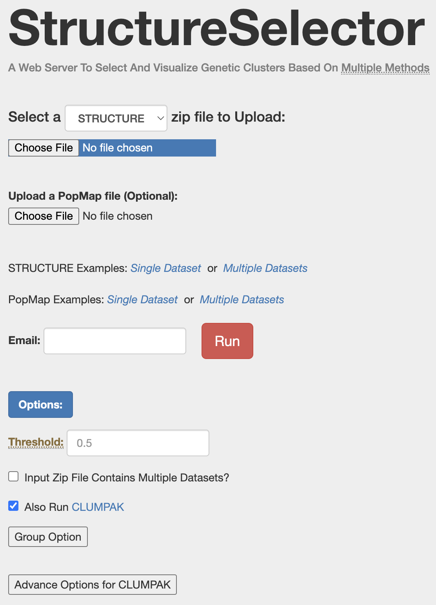
</p>

<br>

### Delta K (Evanno method)
The Delta K statistic looks at the rate of change in the likelihood values as K increases. We're looking for the largest delta K value.

K = 1 and the highest K value will not have delta K values because delta K is calculated with K+1 and K-1.

The delta K values should be at least in the thousands (preferably tens of thousands). Low values indicate a lack of population differentation.

<p align="left">
  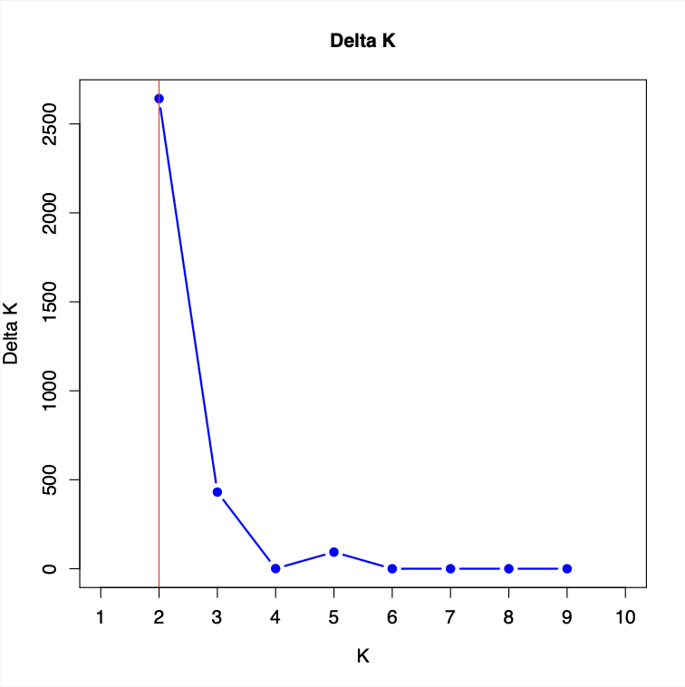
</p>

The figure suggests K=2 but there is a preferential bias towards K=2 (Janes et al. 2017), so in this example I would consider K=2 through K=5. The slightly elevated delta K for K=5 suggests the presense of minor population structure.

Limitations of delta K:
* It is "more likely to identify the uppermost level of hierarchical population structure, thus will lead to underestimating of structure." [Li and Liu (2018)](https://onlinelibrary.wiley.com/doi/abs/10.1111/1755-0998.12719)
* K=2 bias. [(Janes et al. 2017)](https://onlinelibrary.wiley.com/doi/pdf/10.1111/mec.14187)
* "uneven sample size between subpopulations and/or hierarchical levels of population ... often leads to wrong inferences on hierarchical structure and downward-biased estimates of the true number of subpopulations." [Puechmaille 2016](https://onlinelibrary.wiley.com/doi/abs/10.1111/1755-0998.12512)

<br>

### LnP(K) (likelihood)
This is the log of the likelihood of the data given a specific number of populations.

The plot should be a plateau-shaped like this, and K is where the plot starts to create a plateau of values (shown in red):
<p align="left">
  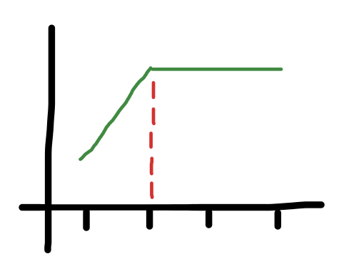
</p>

In our example, the plateau is reversed, however, I would select K=5 because that is where the plateau starts. You could also argue that the plateau starts at 2 (there's a slight difference between K=1 and K=2).
<p align="left">
  
</p>

<br>

###  Puechmaille statistics
Once you have subset of K values to further test, rerun StructureSelector:
1. Make a zip file that only has the STRUCTURE output files from the K values of interest.
  * The files are named by K value and iteration, so "1.25.output_f" means k=1, iteration 25.
2. Go to https://lmme.ac.cn/StructureSelector/ and upload the zip file and PopMap file (if available).
3. In the Options, set `Threshold` to a range of values: `0.5;0.6;0.7;0.8;0.9`.
  * The threshold is the minimum Q value that an individual needs to be assigned to a cluster. Lower threshold values can increase the percentages of individuals with correct assignment if they are admixed.
4. Press `Run`

<p align="left">
  
</p>

The Puechmaille statistics account for uneven sampling across populations. With the delta K statistic, "uneven sample size between subpopulations and/or hierarchical levels of population ... often leads to wrong inferences on hierarchical structure and downward-biased estimates of the true number of subpopulations." [Puechmaille (2016)](https://onlinelibrary.wiley.com/doi/abs/10.1111/1755-0998.12512). 

The plots should be plateau-shaped. To determine K, I look for where the plateau occurs on the y-axis AND if it matches up to the same value in the x-axis (the math for this is complicated). 
<p align="left">
  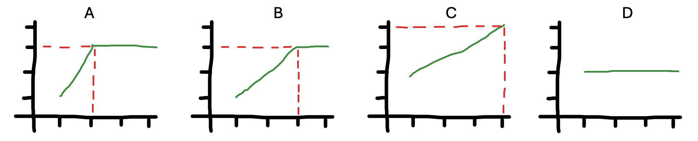
</p>

* A. I would not evaluate for K
* B. K=3
* C. K=4
* D. I would not evaluate for K


Multiple threshold values are tested to check for concordance. K values that vary across threshold values indicate a lack of population structure. --> check if true <--

In the following figures, the Puechmaille statistics show high support for both K=4 and K=5. In threshold = 0.9, so few individuals are being assigned to clusters that there isn't population differentiation across K values --> check if true <--

#### 0.5
<p align="left">
  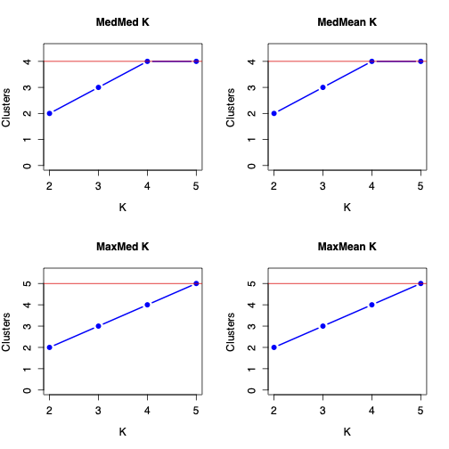
</p>

#### 0.6
<p align="left">
  
</p>

#### 0.7
<p align="left">
  
</p>

#### 0.8
<p align="left">
  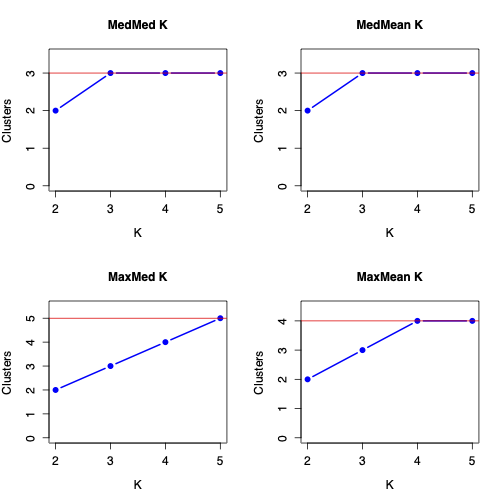
</p>

#### 0.9
<p align="left">
  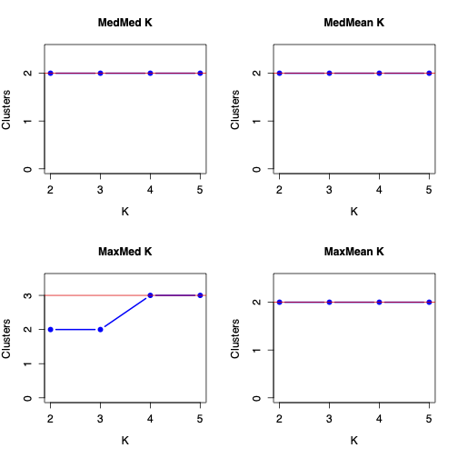
</p>

<br>

___

## Q-Matrix visualization (barplots)
Bar Plot components:
* Individuals as Bars.
  * In the bar plot, each individual is represented by a single bar (column).

* Populations as Colors.
  * Different colors within each bar represent different populations.

* Segment Lengths.
  * The length of each color segment within a bar corresponds to the Q value, indicating the proportion of the individual's genome that is assigned to that particular population.

Interpreting the Bar Plot:
* Homogeneous Populations:
  * If individuals in a group have bars that are predominantly a single color, this suggests that the individuals in this group have a high membership proportion in one population, indicating genetic homogeneity within this group.

* Admixed Individuals:
  * Bars with multiple colors indicate admixed individuals, meaning their genomes are derived from multiple populations.
   * The proportions of different colors indicate the degree of admixture.

* Population Structure:
  * Clear boundaries between color segments in the bars of different groups indicate distinct population structures.
  * Gradual changes in colors across groups suggest gradual genetic differentiation or gene flow between populations.


In the StructureSelector output files, look for a file named something like "job_1718301549_pipeline_summary.pdf".

<p align="left">
  
</p>


Choosing K from barplots is somewhat subjective.

In this example, first, the blue and orange clusters are consistent across multiple K values, so those are plausible.

Second, the green and purple admixture is found across multiple K values and the pattern is consistent, so those are plausible.

Third, K=4 is the lowest K value with blue, orange, purple, and green populations. It has the major patterns without too much random admixture (where the admixture patterns are not consistent across K values). In K=5 through K=10 you don't really see any unique clusters. For example, the main pattern in K=4 is the same as in K=5, but K=5 just has random pink admixture, no pink individuals or "mostly pink" individuals. This easier to see in K=6 with the light pink admixture.

Fourth, in the minor cluster plots, the admixture in populations 4 and 17 is worth following up on with hierarchical analysis (where STRUCTURE is run on population 4 only and population 17 only).

So I would conclude K=4. Even though it is the only K value with green admixture in population 17. Furthermore, based on the prior sample location data, the K=4 corresponds to the number of major sampling locations. K=5 is worth mentioning because of minor cluster 2.

___

## Making STRUCTURE bar plots
To make a Q-matrix bar plot, get the CLUMPP output file `ClumppIndFile.output` for the desired K value.
<p align="left">
  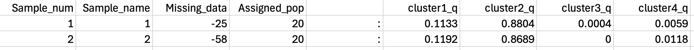
</p>

Make a new csv file with the `sample name`, `assigned population`, and `Q value` columns.
* Sample names are in the same order as the input STRUCTURE file.
  * If you want the actual sample names displayed in the figure, rename the sample numbers.
* If you want to group the samples by some other factor (e.g., prior clusting data), add the data as an additional column.


### Recreate the CLUMPAK barplot 
Here, clusters are stacked in the same order across columns (as in CLUMPAK)
<p align="left">
  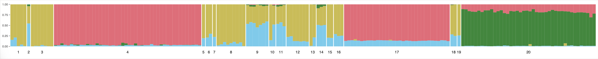
</p>

```
library(ggplot2)
library(tidyr)

q_matrix <- read.csv("K4.csv")

q_matrix_long <- q_matrix %>% pivot_longer(cols = c("cluster1_q", "cluster2_q", "cluster3_q", "cluster4_q"), names_to = "cluster", values_to = "Q")

# Order the populations in the same sequence as the CLUMPAK plot
q_matrix_long$Assigned_pop <- factor(q_matrix_long$Assigned_pop, levels = c("20","4","17","15","12","8","3","9","14","6","13","1","11","10","18","19","5","16","7","2"))

ggplot(data = q_matrix_long, aes(x = Sample_name, y = Q, fill = factor(cluster))) + 
  geom_bar(width = 1, stat = "identity", position = "stack") +
  scale_fill_manual(values = c("cluster1" = "#EE6677", "cluster2" = "#228833", "cluster3" = "#CCBB44", "cluster4" = "#66CCEE")) +
  facet_grid(.~Assigned_pop, switch = "x", scales = "free", space = "free") +
  theme_minimal() +
  theme(legend.position = "none", panel.grid = element_blank(), panel.spacing = unit(0,"lines"),
      axis.title.x = element_blank(), axis.text.x = element_blank(), axis.title.y = element_blank(), axis.text.y = element_text(size=7), axis.ticks.y = element_line(size = 0.25), axis.ticks.length = unit(3, "pt"))

ggsave("K4_group_by_cluster.png", plot = last_plot(), width = 20, height = 2, units = 'in')
```

<br>

Here, clusters are stacked from largest to smallest Q value.
<p align="left">
  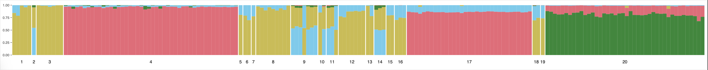
</p>

```
# "group = Q" stacks the barplot from largest to smallest segments.

ggplot(data = q_matrix_long, aes(x = Sample_name, y = Q, fill = factor(cluster), group = Q)) + 
  geom_bar(width = 1, stat = "identity", position = "stack") +
  scale_fill_manual(values = c("cluster1" = "#EE6677", "cluster2" = "#228833", "cluster3" = "#CCBB44", "cluster4" = "#66CCEE")) +
  facet_grid(.~Assigned_pop, switch = "x", scales = "free", space = "free") +
  theme_minimal() +
  theme(legend.position = "none", panel.grid = element_blank(), panel.spacing = unit(0,"lines"), axis.title.x = element_blank(), axis.text.x = element_blank(), axis.title.y = element_blank(), axis.text.y = element_text(size=7), axis.ticks.y = element_line(size = 0.25), axis.ticks.length = unit(3, "pt"))
```

<br>

### Barplot where individuals are grouped by some other factor
Here, samples are grouped by previously determined clusters.

<p align="left">
  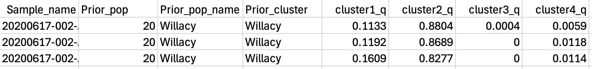
</p>

<p align="left">
  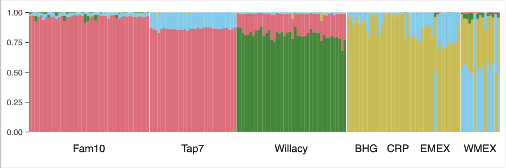
</p>

```
library(ggplot2)
library(tidyr)

q_matrix <- read.csv("K4.csv")

q_matrix_long <- q_matrix %>% pivot_longer(cols = c("cluster1_q", "cluster2_q", "cluster3_q", "cluster4_q"), names_to = "cluster", values_to = "Q")

# Order the clusters in the desired order
q_matrix_long$X2019 <- factor(q_matrix_long$Prior_cluster, levels = c("Fam10", "Tap7", "Willacy", "BHG", "CRP", "EMEX", "WMEX"))

ggplot(data = q_matrix_long, aes(x = Sample_name, y = Q, fill = factor(cluster), group = Q)) + 
  geom_bar(width = 1, stat = "identity", position = "stack") +
  scale_fill_manual(values = c("cluster1" = "#EE6677", "cluster2" = "#228833", "cluster3" = "#CCBB44", "cluster4" = "#66CCEE")) +
  facet_grid(.~Prior_cluster,switch = "x", scales = "free", space = "free") +
  theme_minimal() +
  theme(legend.position = "none", panel.grid = element_blank(), panel.spacing = unit(0,"lines"), axis.title.x = element_blank(), axis.text.x = element_blank(), axis.title.y = element_blank(), axis.text.y = element_text(size=7), axis.ticks.y = element_line(size = 0.25), axis.ticks.length = unit(3, "pt"))

ggsave("K4_group_by_location_data.pdf", plot = last_plot(), width = 6, height = 2, units = 'in')
```

<br>

### Multiple barplots in the same figure
Here, we will place the K=4 major barplot next to the K=5 MinorCluster2 barplot.

In the csv file combine the K=4 and K=5 datasets. Make a new column named "K" and fill it with the K value the data came from. Because the K=4 data doesn't have values for cluster 5, fill in an imperceptable q value instead of 0 (this avoids the error "Error "At least one layer must contain all faceting variables" when plotting).

<p align="left">
  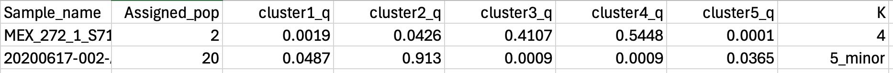
</p>

<p align="left">
  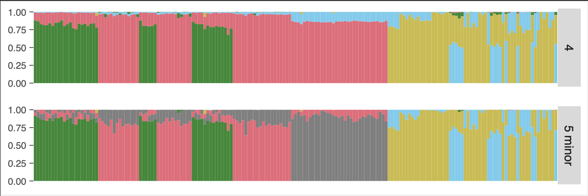
</p>


```
# change to facet_grid(K~.) to make plot horizontal

library(ggplot2)
library(tidyr)

q_matrix <- read.csv("K4_K5minor2.csv")

q_matrix_long <- q_matrix %>% pivot_longer(cols = c("cluster1_q", "cluster2_q", "cluster3_q", "cluster4_q", "cluster5_q"), names_to = "cluster", values_to = "Q")

# Change to facet_grid(K~.) to place the plots horizontally.
ggplot(data = q_matrix_long, aes(x = SampleID, y = Q, fill = factor(cluster), group = Q)) + 
  geom_col(width=1) +
  scale_fill_manual(values = c("cluster1" = "#EE6677", "cluster2" = "#228833", "cluster3" = "#CCBB44", "cluster4" = "#66CCEE", "cluster5" = "#BBBBBB")) +
  facet_grid(K~., switch = "x", scales = "free", space = "free") +
  theme_minimal() +
  theme(legend.position = "none", panel.grid = element_blank(), panel.spacing = unit(1,"lines"), axis.title.x = element_blank(), axis.text.x = element_blank(), axis.title.y = element_blank(), axis.text.y = element_text(size=7), axis.ticks.y = element_line(size = 0.25), axis.ticks.length = unit(3, "pt"))

ggsave("K4_K5minor2_group_by_pop.pdf", plot = last_plot(), width = 6, height = 2, units = 'in')
```


