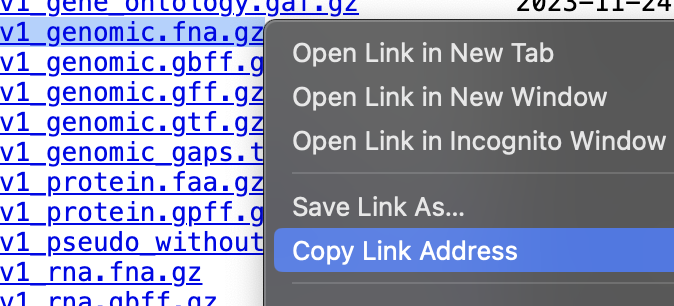
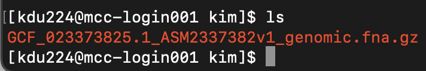

# Remote cluster (MCC)


## Connect
Use `ssh` (secure shell) to connect from your computer to the MCC cluster.

On **your computer** run `ssh user_name@mcc-dtn.ccs.uky.edu` 

The first time you connect to the cluster, you will get this message:

Type `yes` to continue.

After successfully logging in, you should see a prompt similar to: <br>
`[user_name@mcc-login001 ~]$`

To disconnect from MCC, run `exit`

NB: Once you connect, you will be working with two computers: your local computer and the remote cluster. When running commands, pay attention to where your working directory is located (i.e., which computer you are working on.)

___

## Make your working directory on MCC
1. After logging on to MCC, display your working directory by running `pwd`. It should look something like this:

`[user_name@mcc-login001 ~]$ /home/user_name`

2. Go to our course directory.

`cd /pscratch/jdu282_brazil_bootcamp2023/`

3. View the contents of the class directory with `ls`
4. Now make a new directory in the "students" folder (do not include < > in the folder name).
```
cd students
mkdir <your_name>
```
5. Run `ls` again. You should see a folder with your name. How do we know it’s a directory? The name is color-coded in blue.

___

## Transferring files 

### Copy files from your computer to the cluster
Your current working directory and local_file needs to be on your local computer.

If local_file is in your current working directory:

`scp local_file user_name@server_address:/path/to/cluster/directory`

If local_file is in another directory:

`scp /path/to/local_file user_name@server_address:/path/to/cluster/directory`


### Copy files from the cluster to your computer
Again, run the command from your local computer.

`scp user_name@server_address:/path/to/cluster/remote_file /path/to/local/directory`<br>

If the destination is the current working directory, the path to the current working directory can be replaced with `.` such that `scp user_name@server_address:/path/to/cluster/file.txt .` can be used instead of the full path.

**_Question:_** How do you modify the `scp` command to copy a directory?

**_Task:_** Copy the `hello.txt` file you made previously from your computer to your folder on the cluster.


___

## Modules
Some programs are already installed on MCC, however, they will not work until they are activated.

`module list` lists the activated programs onto your account.

`module avail` lists the programs installed on LCC. Use `module avail | grep "program_name"` to search for a specific program (note that most module names on in lowercase).

`module load module_name` activates the program

`module unload module name` deactivates/removes the program from your account

___

## Singularities
These are like modules. The full list of available programs is [here](https://ukyrcd.atlassian.net/wiki/spaces/UKYHPCDocs/pages/2920537/Software+list+for+singularity+containers+for+conda+packages+in+the+MCC+cluster)

Instead of loading them, however, the singularity information is added to your batch script (more on this later).

___

## Slurm job submission & batch scripts
MCC uses Slurm (Simple Linux Utility for Resource Management) to manage user demand and system resources. 

Commands, or "jobs", are submitted with batch scripts. Batch script files must end in `.sh` and must start with the following lines:

```
#!/bin/bash
#SBATCH --time=             # How long you want to use the resources
#SBATCH --nodes=            # How many processors; typically 1
#SBATCH --ntasks=           # How many cores on the processor
#SBATCH --partition=        # Processor type
#SBATCH --account=          # CPU hours are monitored and charged

Optional
#SBATCH --mail-type=ALL     # Notify when job starts/ends/fails
#SBATCH --mail-user=        # Your email address
```
The format for --time= is day-hour:minute:second, e.g., 00-01:00:00 means 1 hour.

NB: Notification emails often end up in spam/junk folders.

**_Task:_** In your folder on MCC, make a new file named "batch_header.sh" and add the following lines. We will use this file as a template for making batch files.
```
#!/bin/bash
#SBATCH --partition=normal
#SBATCH --time 14-00:00:00
#SBATCH --nodes=1
#SBATCH --ntasks=32
#SBATCH --account=coa_jdu282_brazil_bootcamp2023
#SBATCH --mail-type ALL
#SBATCH --mail-user <your email address>
```

To submit a job run `sbatch your_batch_script.sh`


Once you submit a job, you can check it's status with `squeue | grep mcc_user_name`. If all processors are in use, your job will wait until resources are available; TIME 0:00 means your job has not started.


Each job gets a job number and a corresponding `slurm-job_number.out` file. This file has the information that is normally printed to the screen as the program is running. 

To cancel a submitted job use `scancel job_number` (get the job number from `squeue | grep mcc_user_name`)

NB: All data analysis should be submitted as a job. **Do not run jobs on the login node.**

___

## **_Task:_** download files from NCBI
We will download the latest Bactrocera dorsalis (oriental fruit fly) reference genome from NCBI (National Center for Biotechnology Information (USA)).

1. In a web browser, go to https://ftp.ncbi.nlm.nih.gov/genomes/all/GCF/023/373/825/GCF_023373825.1_ASM2337382v1/
2. Right-click and copy the link for `GCF_023373825.1_ASM2337382v1_genomic.fna.gz`


3. In your folder on MCC `/pscratch/jdu282_brazil_bootcamp2023/students/your_name`
type `wget` and then paste the link:
`wget https://ftp.ncbi.nlm.nih.gov/genomes/all/GCF/023/373/825/GCF_023373825.1_ASM2337382v1/GCF_023373825.1_ASM2337382v1_genomic.fna.gz`

4. After downloading, your folder should look something like this:


How did I find the FTP page?
1. I searched for "Bactrocera dorsalis" on https://www.ncbi.nlm.nih.gov/
2. Then I clicked on "Genomes" and selected the genome with the green check (which is the latest reference genome).
3. I ignored the big download button and instead navigated to the FTP server.


___

## **_Task:_** get a copy of the individual sample files
In the course folder is a directory named "data"